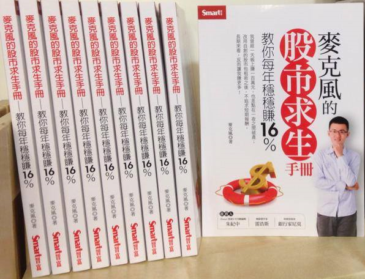

# 關於我

如果對我過去在各處撰寫或蒐集的文章有興趣，下面整理的連結可以做為一個開始：

巴菲特與孟格：[歷年股東信跟股東大會問答錄中文翻譯，專欄演講等](https://sites.google.com/view/buffett)

FB粉絲團：[投資、詐騙、政治是討論三本柱](https://www.facebook.com/mktsurvivalkit/)

Blogger：[近年比較少更新，之後打算多放一些書評](https://stasistw.blogspot.com/)

PTT：[Stock版精華區](https://www.ptt.cc/man/Stock/D2A8/D23/index.html) / [Stock](https://www.ptt.cc/bbs/Stock/search?q=author%3Astasis) / [Option](https://www.ptt.cc/bbs/Option/search?q=author%3Astasis) / [Trading](https://www.ptt.cc/bbs/Trading/search?q=author%3Astasis)  
  
Youtube：[JG訪談、財經節目來賓等](https://www.youtube.com/results?search_query=%E9%BA%A5%E5%85%8B%E9%A2%A8+%E9%99%B3%E5%BD%A5%E6%96%87)

演講Powerpoint：[這份是底稿，會依照主題微調](https://drive.google.com/file/d/1vHzdyiclJ1MPPn1RUZivPKWWBmKELPwg/view)

麥克風的股市求生手冊：[連結是綠角的書評](http://greenhornfinancefootnote.blogspot.com/2016/03/blog-post.html)  
  
麥克風的學習地圖：[書評、外語學習、還有更多](https://sites.google.com/view/stasismap/main)

