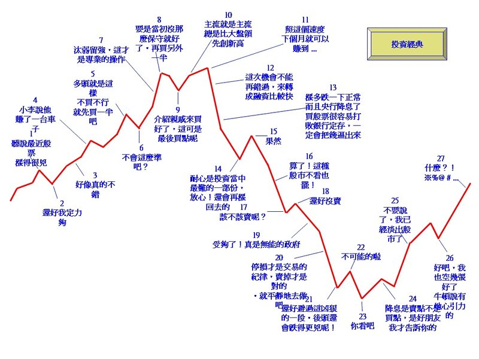

# 歷史總是一再循環

1985到1990，台灣指數最光輝的一段歲月。經濟的高速成長，加上台幣強烈的升值預期，造成海外的熱錢大量流入台灣，造就了「台灣錢，淹腳目」的局面，房地產在短時間內就翻了兩翻，中間雖然經歷過1987年的全球股災，崩跌程度高達50%；以及1988年時，財政部長郭婉容在中秋節前夕宣佈開徵證所稅，造成指數連續19天跌停板的奇景，台股指數依然從1985年的低點636點，瘋狂上漲到12682點，差距將近20倍，當時市場樂觀的情緒瀰漫，大家普遍認為股價會上漲到15000點以上。

這個時代的股市已經不再是理論上那種，讓大眾一同分擔企業投資風險，並共享企業獲利成果的所在，而是一個巨大的賭場，在那段時間中，任何人都可以輕鬆達到一年數十%的報酬率，要是運用丙種資金，年報酬翻上數倍都不是稀奇的事。

高額的報酬吸引了越來越多的人參與股市，全民瘋股票的結果，成交量甚至曾經達到東京和紐約證交所兩者的總和，高額的成交量代表的是高市值以及高週轉率，絕大多數的交易都是由散戶所貢獻。當時的號子門口是車水馬龍，店內是人山人海，營業櫃台永遠都擠滿人，即使開了冷氣依舊像鍋爐，下單買賣股票的人，要是擠不到櫃台，甚至得用竿子將單子吊給櫃檯的人。

當時的股票薄薄一張，卻像是用黃金打造的一樣，金融與資產股百元以上毫不稀奇，多得是500元以上甚至突破千元的個股，其中又以1972元的國泰最為膾炙人口，一張股票就足以在台北買下一間房子，股價稱王將近十年之久。台股的本益比衝上了100倍，榮登全球最昂貴股市的寶座。

要支持如此瘋狂的多頭市場，必然要有一些理由，以下就是幾個當時最流行的多頭邏輯：

1. 由於持續多年的高儲蓄率、貿易順差和熱錢湧入，使得台灣的資金供給大量膨脹，且由於這些資金可以投資的管道有限，只能湧入股市，而這種流動性過剩的狀況，短時間內都不會消失。
2. 台灣的上市公司，在資產負債表上有大量被低估的資產，例如土地或其他上市公司的股票，若將這些資產的價值重估，現今的股價仍舊處於合理水準。
3. 市場上的作手會一直支持市場，因為如果崩盤，他們也會受到損失；政府也不會讓股市泡沫破裂，他們害怕失去選民的支持。

上面的說法，即使挪到現在來用，是不是都還有些熟悉？這場台股史上最大的多頭盛宴，終於在1990波灣戰爭開始後劃下了句點，指數從年初的12682點，狂洩到2485點，在泡沫行情當中看來實際存在的資產，終究也如同泡沫一般消逝，那些在多頭中堅持買進，因此獲致巨富的人，多半也在狂跌之後回到原點，甚至因為運用融資而負債累累，當時叱吒風雲的四大作手，也逐漸的從市場淡出。

1990年代，股市的主流逐漸從金融、資產股，移轉到了電子股，由於新科技的快速發展，讓以電腦相關代工為主的台灣電子業獲利也跟著節節高升，金融資產股則走入了十年長空，華碩在85年的時候以108元掛牌，短短幾個月就漲到890元，成為新一代股王。這個年代的股王變動較快，88年廣達最高850元，89年威盛最高629元，90年的禾伸堂999元，只差1元就可以突破千元大關。

在新一波的狂潮當中，「新經濟」取代了「舊經濟」，網際網路的出現，徹底改變了世界經濟的運作模式，衡量公司價值不再靠「本益比」，而是「本夢比」，只要畫出來的餅夠大，即使公司沒賺到什麼錢，一樣可以漲到天外天。那個時代的台灣經濟，似乎看不到一點烏雲，理財雜誌宣傳的都是樂觀的願景：

「買錸德3年賺10倍」 「買華碩5年30倍」 「聯電五合一企圖超越台積電」 「威盛稱霸全球晶片組市場」

那時每個月都可以看到個股營收又創新高，大家覺得這次的榮景有實際獲利支撐，和過去的泡沫不一樣；電子股的合理本益比是25到35倍，理財大師出書宣傳「隨便買、隨時買、不要賣」，這種榮景似乎可以持續到永遠；登上萬點時，散戶群聚在號子裡開香檳慶祝，討論的是未來究竟是上看12000還是15000。

當時看長空可是會被嘲笑甚至圍剿的，可是就從沒有人想到的地方，台股開始一洩千里，從4月的10328，一路殺到年底的4555。殺到8000點時，大家還覺得只是多頭段中的回檔，但之後瘋狂的下挫，卻讓所有人都笑不出來了；有人在300喊進錸德，腰斬搶進，再腰斬瘋狂搶進，直到錸德被斬到剩下腳踝，那個人才從討論區消失。我也聽過身邊的人，在威盛「回檔」到500元的時候融資買滿。

斷頭賣壓就跟雪球一樣，滾也滾不完。為了拯救災民，政府可說什麼方法都用盡了，首先限制漲跌幅，結果每天照樣跌停，現貨撐不住改撐期貨市場，尾盤把價格從跌停拉到漲停，隔天繼續跌停；四大甚至國安基金護盤的結果，只是把納稅人的血汗錢繼續往深淵裡面丟，順便造就了張松允的傳奇。

恐怖的空頭似乎無止無盡，低迷的行情持續了近兩年，融資餘額從高檔的5000億以上，減少到最低點的1092億。然而促使下一波多頭形成的，卻是兩架撞上雙子星的飛機，大家都認為世界經濟會隨著恐怖活動一同沉淪，股市從911前的4300點，在短短兩個星期內跌到3411，但隨後卻是3000點的大漲。

2003年的SARS則是另外一個恐慌造就低點的例子，和平醫院隔離讓全國陷入恐慌，大家都不敢出門，室內幾乎人人戴口罩，N95口罩瘋狂大缺貨。當時我還在唸書，出入宿舍都要量體溫，一有人發燒就是全寢隔離，新聞一片愁雲慘霧，但這卻造就了另外一次3000點的大漲。

幾年過去了，不一樣的時空背景，卻是差不多的故事。2006年，太陽能的風潮興起，在作手和投信的聯合加持下，茂迪從2004年的70元上下，衝到了最高價的985元，雖然挑戰千元未果，但卻澤惠隨後上市的益通，讓其衝到了1205元的天價。作手張天福靠著茂迪獲利4億多元，也因此遭到檢調調查，但一審無罪收場，因為法官認為他大量買進後在高檔賣出，是「個人合理投資判斷」。

從2007年中開始，台股幾度試圖突破萬點，在投機氣氛達到高潮時，做賭博機的伍豐，成為了新股王，股價突破了千元大關。眾多的市場專家宣稱政黨二度輪替後，由於兩岸政治情勢的不安定因素消失，台股會直上12000甚至20000點，報章雜誌中充滿「長期投資賺大錢」的例子，新興市場、精品基金、原物料基金瘋狂熱賣。

群眾們再度在一片樂觀之中投入股市，完全忘記數年前的教訓，許多人甚至賭身家、押房子，反應在盤面上便是融資暴增，成交天量。結果卻和八年前的政黨輪替如出一轍，新總統上任沒兩天，散戶們就得開始面對如同自由落體般的下跌，世界的金融體系也在下跌當中不斷發出警訊，次級房貸危機、衍生性商品風暴、百年老店雷曼倒閉、恐慌指數VIX創下歷史新高……

在一連串的利空之中，到2008年底台股指數已經跌了超過50%，融資再度開始滾雪球，從3000多億的高點跌落到剩下1000億出頭，許多先進國家的股市甚至跌回了十年前的水準。民眾在這個時候才發現，那些曾經擁有的財富不過是紙上雲煙，沒賺到錢不說，最慘的是連自己辛勤工作賺來的血汗錢都賠進去了。而在金融市場市場似乎要解體的那時，新一波的多頭正在悄悄醞釀著……

翻開歷史線圖，把近十年來的底部圈起來，簡單的觀察一下價與量，再回憶一下當時的新聞跟市場氣氛，過去的波段低點，似乎總伴隨著災難的發生，台海飛彈危機、兩國論、921、911、SARS……多空不斷循環，每一段故事都有不同的主角，主角會變，但是大盤訴說的故事其實都差不多。

**「行情總在絕望中誕生，在半信半疑中成長，在歡欣鼓舞中結束。」**

