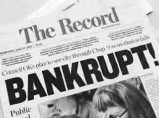

# 破產過才算投機家？

史上幾位傳奇的投機客：德國的科斯托蘭尼、美國的傑西李佛摩、和日本的是川銀藏，都經歷過數次的破產，科斯托蘭尼甚至還說過：「一名證券投機家如果一生沒有至少破產二次，就稱不上投機家。」但這三位名人當中，只有科斯托蘭尼一人能夠安享晚年；傑西李佛摩在大崩盤時放空，連美國政府都不得不跟他低頭，請求他回補，但他一生大起大落，破產了四次，最後在飯店裡舉槍自盡；是川銀藏在1982年大賺200億日圓，成為日本當年繳稅最多的人，身故後卻只留下數十億日圓的債務。

這些傳奇投資客能夠在市場上賺入大筆財富，除了敏銳的市場感覺外，另外一個重要的因素就是槓桿與重押，他們在發現機會時，都會大量的舉債投機來擴大獲利，準確的眼光讓他們能夠以超常的速度累積財富。但槓桿是把兩面刃，成功看對時獲利飛快，失敗時的下場就是大賠甚至破產。唯一想透這點的似乎只有科斯托蘭尼，而他給投資人的另外一個忠告是：「不要借錢買股票。」只要能做到這點，交易破產這件事就幾乎與你無關。

理財雜誌很喜歡專訪那些下大注重押，然後一夕致富的「傳奇」，同時宣傳他們選到這些神奇飆股的方法。但這些傳奇的背後，多半都有破產的歷史，他們的大賺與大賠，其實都是因為同一個原因。**若這些傳奇不改初衷，依然執迷於重押，未來仍然能夠持盈保泰，脫離「大賺、大爆炸、東山再起」循環的究竟有多少？**

