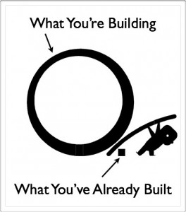
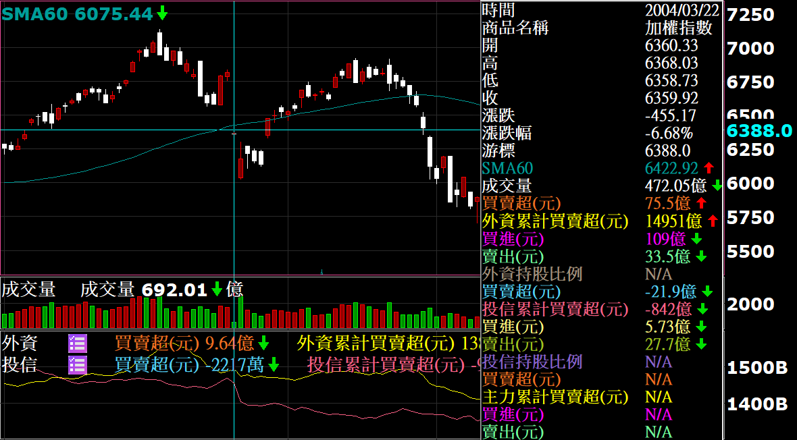
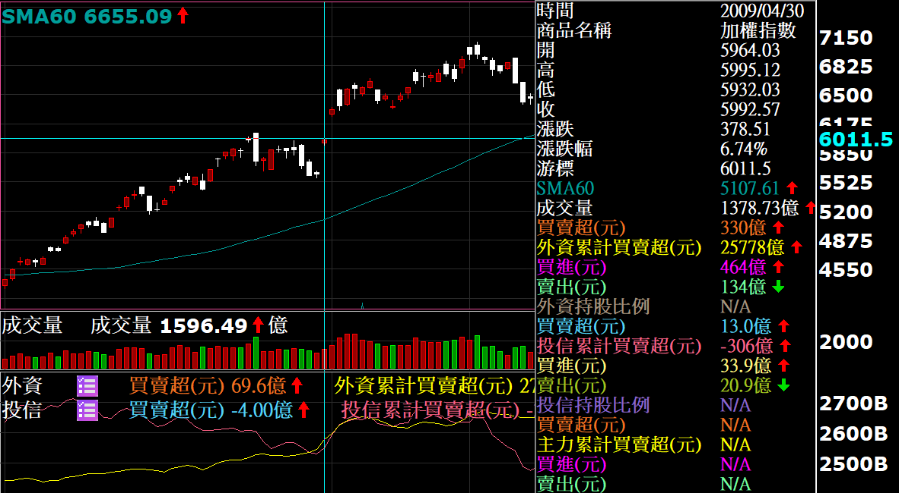

# 槓桿

2009年4月的台指保證金8萬6，實際契約規格以指數5500來算約5500x200=110萬，6000點的話則是120萬，槓桿約12-14倍。

下面算一下硬食跳空停板時出現的虧損（6000點大台為例，選擇權賣方建議比照小台計算）：

| 槓桿倍數 | 一根停板 | 兩根停板 | 幾萬做一口 |
| :--- | :--- | :--- | :--- |
| 2 | 14% | 28% | 60萬 |
| 3 | 21% | 42% | 40萬 |
| 4 | 28% | 56% | 30萬 |
| 5 | 35% | 70% | 24萬 |
| 6 | 42% | 84% | 20萬 |
| 7 | 49% | 98% | 17萬 |

一般人常說：三口糧一口單。按照此說法，保守點準備30萬玩一口好了，槓桿以目前之保證金來算將近4倍，1根停板賠28%，2根賠56%。在運用槓桿的同時，你準備好賠那麼多錢了嗎?

### 血淚換來的教訓

講一下我的慘痛經驗好了，2004年的319時我持有14口大台多單留倉，隔週一（3/22）盤前掛市價平都出不掉，硬食兩根停板。目前為止台指從開盤到收盤都一價到底，好像只有那一次，正巧就讓我遇到了。

從此之後，我部位整體槓桿（多空相抵後）很少超過2倍。少數時刻我還是會買選擇權以提高槓桿，但選擇權買方碰到上面這種極端狀況又做錯邊頂多歸零，所以不記入總槓桿，但我計算風險時會把買選擇權的錢，從總資金中暫時扣掉。

2008年10月還11月的時候我留空單，吃過一根漲停；2009年4月29日我也是空單留倉，隔天又吃一根漲停出場，老實說吐了不少，但整體報酬還是贏指數。

由上面的故事可知，遇到極端跳空的時候，我幾乎總是站在錯的一方，但至少我沒有吃過歸零糕，長期績效也過的去。總之，市場比的是氣長，只要帶賽的時候別炸掉，之後總有機會可以翻身，先控制好風險，長期才比較有機會獲利。

