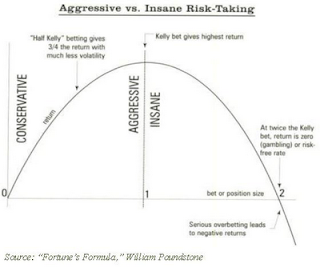

# 凱利公式

靠著凱利公式Kelly Formula，我們可以很輕鬆的算出特定勝率和風險報酬下的最佳投注比率。其公式如下，對推導過程有興趣的話，可以自己上網找：

K=P-\(1-P\)/R

K 最佳下注比例   
P 勝率   
R 風險報酬比率

將上篇文章中遊戲的規則套進這個公式裡，K=0.5-\(1-0.5\)/2=0.25；當風險/報酬為3:1時，K=0.33；當5:1時，K=0.4。風險報酬比越高，求出來的K值就會越接近勝率。

大家可以拿這個公式，對應到自己平常的交易：你單一交易出場時的勝率為何？獲利和虧損比率又是多少？

當然這個公式忽略了很多現實層面上的問題，像是手續費和稅的影響（這可以靠下修風險報酬關係調整）、連續虧損（資本小的時候，這可能會讓你失去玩遊戲的資格）、以及系統性風險的發生（319時可是兩根跌停板）等等。

因此實際交易時，必須要用遠低於理論值的資金比例，現實交易可不是在賭銅板，投入資金過大，一個大跳空就可能讓你升天，就算真的是賭銅板，我也不會下這麼大比例的注，天曉得這銅板是不是公平的？總之，在估計K的時候，儘量用最保守的數據吧。

還有在運用凱利公式的時候，不需要考慮加碼，因為進場時已經是避免系統失速所能容許的最大部位了。除非操作時看的是週線以上，在同一筆交易內，總資金所容許的最大部位增加，這時加碼才有意義。

