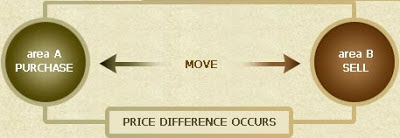

# 交易系統

以下儘量用最簡單的方式來說明，如何建構一套交易系統，這裡用趨勢交易系統來示範：

### 決定操作週期

看是要用週線日線小時線或者分鐘線， 週期越小訊號就越多，負擔的手續費成本也會越高， 但是能抓到的細微波段相對也會比較多，好壞請先自行測試歷史資料。

波段操作的宿命就是勝率低，盤整期很可能會不斷的停損； 但是相對的風報比也高，如果看的週期長一點（日線以上）， 進出可能是以週甚至月為單位，畢竟獲利是「等」出來的。

### 判斷週期趨勢

現在到底是多？空？還是盤整？k線圖叫出來看就是了，最好再看一下上一級和次一級趨勢的狀態。 例如用日線操作，就再看一下週線和60分線的狀況， 你可能會得出「週線往上，日線盤整，60分線往下」這樣的結論。

參考上級趨勢的理由是，可以避免自己做到逆勢單。 （例如週線往下卻不斷試日線多單，這樣只會對最後一次）

### 決定進場點

兩種典型的策略：回檔（反彈）到一定程度試單、突破前高（低）試單。 這邊可以參考次級趨勢，例如日線作多，就等60分線一併轉強再進場。

各有優缺點，大部分的時候前者比較好用，因為追高殺低的勝率較低， 但是遇到噴出時，後者的獲利會遠高於前者。

### 決定出場點

出場點最好設定在「你的系統會發出趨勢反轉訊號」的位置， 因此這個位置應該是浮動的，決定於趨勢的發展程度，有可能是停損， 也有可能是停利。固定停損/浮動停利也是可行的作法， 一切取決於先摸到停損或停利。

均線和指標都是簡易實用的參考點，但既然這是趨勢系統， 那麼過濾雜訊的功能是必須的，你總不希望做日線多單， 但30分線或5分線一轉弱就出場吧，這樣會永遠抱不到大波段。

