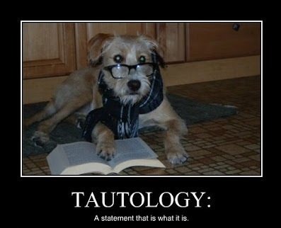
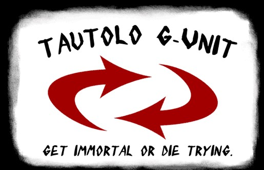

# 波浪？科學？玄學？

當科學家提出某種假說時，必須要提出很多潛在的問題，探討這樣的理論有沒有道理，直到確認這個假說具有充分的解釋力後，才能成為理論。在驗證的過程中，簡單的假設會勝過複雜的假設，因為比較容易推翻，也比較容易去運用，唯有可以被其他人否定的假設，才能成為好的理論，換句話說，若理論無法被證偽，都不能算是科學理論。  
  
市場中有許多被視為理所當然的理論，被無數的交易者視為理所當然，但完全無法接受考驗，舉常見的一個說法：「股票為什麼會上漲，就是因為它正在上漲；股票為什麼會下跌，就是因為它正在下跌。」這個說法其實只是套套邏輯，正因為其不可能被推翻，因此也沒有任何解釋能力，但有不少人會將這個論點視為「要去買正在上漲的股票。」  
  
再來說有名的市場效率理論，其原始理論是：市場價格已經把所有的訊息給消化進去，因此投資人無法從觀察市場價格的波動，去預測未來的價格。但這個理論在圖表分析師的口中卻變成：因為市場價格包括了所有的訊息，所以只要觀察價格，就可以知道未來的走勢。很有趣的語言遊戲，不是嗎？  
  
讓理論無法被證偽的另外一個方式，則是將理論儘量的模糊化，使其在任何狀況下都說的通。在股市當中，這類理論最有名的就是艾略特波浪理論。艾略特本人出過兩本關於波浪理論的書，第一本是「波浪理論」，第二本叫做「自然定律—宇宙的奧秘」。有一點希望大家注意的是，他在第一本書當中採用的是觀察與歸納的方式，得出了自然現象都有循環的特性這個結論，我對這個結論其實沒有意見，因為任何人觀察歷史走勢之後，都可以得到同樣的結論。  
  
但在第二本書當中，由歷史觀察得到的理論，卻升級成科學定律，是市場的「真理」，所有的走勢與轉折都可以靠黃金切割和費氏數列計算出來，也正因其強調市場可預測，波浪理論從此一躍成為技術分析的主流之一，但這類方法真的能有效被運用嗎？去詢問任何統計學者，他們大概都會告訴你答案是否定的。但是就和占星學者和樂投專家從來沒有消失一樣，波浪理論直到現在依然興旺，這種將交易提升到玄學的論調，總是能吸引某些追求「真理」的交易者。  
  
艾略特波浪理論的重點在於，市場走勢具有循環的特性，但了解這類明顯的現象，並沒有辦法替你帶來什麼超額的報酬。要從這些循環中獲利，你必須知道這些價格循環的週期與幅度，要去預測這些，艾略特給我們的答案是費波納西數列和黃金分割。常看到第四台的老師指著線圖，口沫橫飛的說：「接下來即將進入第三波主升段，持股要抱牢。」「根據黃金分割，這一波的滿足點為XXX點。」「這裡是第五波的延伸波，走勢會震盪。」但有趣的是，十個大師可以畫出十種波浪，大家都會認為自己才是正宗，事後也總有一種說得通。波浪理論就好像在遊戲裡開了無敵外掛一樣，因為「理論沒有錯，是分析的人用錯了方法。」

### **決戰台股波浪大師**

這個故事可以回溯到2008年的某網路討論版，當時某位在業界頗具盛名，每月定期在網路上出刊預測行情的波浪大師，在這邊稱他m大師好了。他在6月時運用波浪理論計算出了台股的4種可能走勢，其中最差的狀況也不會跌破7000點，還很大膽的表示，如果有人對台股有以上4種走勢之外的看法，代表他波浪學的不到家，莫非定律不存在發生的可能性。我對這種獨斷的說法感到懷疑，因此發文詢問：  
  
\*為方便閱讀，我的發文採粗體，其他人的回應則未加粗  
  
**有點小問題想請教，請問m大在2000年時，有預見到台股會從10393跌落到2001的3411嗎？更極端的例子是90年的12682-&gt;2485，老實說我不認為這可以靠波浪算，為何在這個地方，可以如此篤定不可能歷史重演呢？  
  
要是未來出現了往上突破7604隨後卻又破底的狀況，又該怎麼作？當然這只要靠停損就可以搞定，但是這跟亂數決定要在哪邊作多，然後擺個移動停損利，似乎沒有很大的差別？  
  
若是大部位又沒有配合一定的資金控管，當「萬一」發生時該如何是好？（例如破6135才開始回升）但若是顧及風險，部位沒有那麼大，那麼這些戰略，跟摸著石頭過河的差別又在那邊？』**  
  
他的回答很直接：「只有一萬：百分之一萬不會發生，沒有萬一」「我不覺得做肯定對的事，叫做摸著石頭過河」「你問我為什麼一定不會那樣？很抱歉，我沒有答案，因為書是這樣寫的，盤到目前也沒有出現異常，我就不會去想，一切上帝自有定奪。」  
  
但接下來的幾個月間，大盤不斷的下挫，m大師也不斷的「修正」自己的看法，但在月刊上始終看多，直到十月底才在某篇推文中說自己在9月初已經轉空。我實在看不下去這種幾近是硬凹的行為，於是我又發了一篇文：  
  
**可能是用字的問題吧，m大之前所說「百分之一萬不會發生」的狀況發生了，「唯一解」也出現了例外。如果當時照m大所說「做肯定對的事」，甚至去放大槓桿，而沒有停損（認錯）的配套措施，現在恐怕會很慘，所以對於m大堅信的必然，我個人抱持著懷疑的態度。  
  
台股根據5月號的規劃，是在8400-8600見底，此處為最後上車機會；  
6月號把低點區下移到7011-7236，應持續加碼；  
8月號寫6708不見得是低點，但最多再殺700-1000點便會回升；  
9月號又重新把低點規劃在6267-5565區間。  
  
即使從5-8月都不進場，但要是照9月號規劃在6200以下持續加碼，以現在4500不到的指數，不用槓桿可能都損傷慘重，如果大膽動作，放大槓桿更不用說。當然m大可能完全不照自己的規劃做，甚至9/1後反手放空大賺一票，這我完全相信，因為我也常這樣，個人向來不太相信「自己的看法」。  
  
只是這樣做的話，就如同我前文所問的：規劃的目的何在？跟摸著石頭過河又有什麼差？從頭看多到尾，總有一天會摸到底，只是可能要經歷很長一段的痛苦時光。長線我也是個死多頭，但僅限於在季線之上，電梯向下的時候我寧願戒慎恐懼，因為我不知道會不會出現另一個3411或2485，用槓桿摸底沒什麼，但是一定要有個停損點。  
  
現在離3845還剩幾點？莫非定律不存在發生之可能性？跌了5000點，長期多頭依然不變？（這我倒不否認，股市不過是一連串的循環，空頭走久了自然變多頭）如果覺得我只會質疑沒有建樹，要我拿出自己的規劃的話，那我還真的很抱歉，因為我從來不會去預設高點或低點，隨勢罷了。偶爾在市場氣氛極端樂觀或悲觀的時候小量反向操作，順利摸到頭底再慢慢加碼。  
  
其實我現在和m大的想法差不多：「非常非常—且興奮度持續增加中—的樂觀」因為消費者信心指數創新低，融資跌幅遠超過大盤，我媽下看3000點，股票板空頭言論滿天飛，但是我實在不知道怎麼從波浪中得到這些訊息。』**  
  
大師的回答也是絕妙：「那代表原假設有誤，但那仍未影響長多。」同時列了13點新的規劃，其中提到他在6809跌破後，改變計畫反手空（因為接下來一定會跌！），在5530加空3倍，4805大量回補但依舊淨空。  
  
除了大師之外，另外也有護航的人對我的論點提出質疑，說每個人分析、操作都是靠自己，看別人分析、批評別人分析，自己績效也不會好一點；我既順勢操作，又企圖反向操作摸頭底，覺得我說法自相矛盾。我的回應如下：  
  
**『因為極端走勢後的反轉肉很多，所以我願意用幾次停損去抓反轉。這個看線圖就知道，不過我很老實的說，我完全不會用波浪抓頭底，不知道版上有沒有人願意分享一下呢？我看多，統計數字也支持我在這邊作多，但是我不會說「這邊100%是底部」「這邊是最後進場點」。我很清楚我會犯錯，所以我選擇摸著石頭過河。歷史上有過超級通貨膨脹，股價指數也跟著變成天文數字；也有過股市整個消失，指數變成零鴨蛋的例子。  
  
我每次看到有人因為波浪、黃金等「理論」，做出「不可能漲過（跌破）xxx點」的結論時，就會想到一句廣告詞：nothing is impossible。要是彈沒兩天就下去，我一樣會用空單保護我逐步放大的現股部位，至於手上的現股就繼續給他套囉，反正我沒用槓桿，每年領個1x%現金股利也爽。萬一真的像m大所說跌到688確認空頭了，我還是沒斷頭問題。總之，雖然理由完全不一樣，不過我跟m大的部位目前應該是同方向（吧？）。  
  
我比較好奇的是，如果只是分批往下買，不管是固定比率也好，金字塔也好，那麼畫那些12345abc又有什麼差？我一個什麼都不懂的人，還不是在做差不多的事？還有，在看xx金融分析的人，恐怕有很多是m大所指「腦殘的一般人」吧？如果規劃需要一直修正的話，是不是應該在文後補充說明一下呢？不然要是有人很信任那份月刊，從8700沿路往下作多，那他在5000以下受不了認賠殺出的機率大概也不低吧？』**  
  
由於我過去推薦過Taleb的黑天鵝效應，有人針對這點對我提出了以下的質疑：「統計一定有兩個問題：第一是你樣本有多少？第二每次的事件都一樣？如果你信黑天鵝，你是個懷疑論者，那你就不應該做這些無意義的統計。」針對這些質疑，我的回答是：  
  
**『我想你這樣的推論有點極端，個人認為Taleb想強調的是：  
  
1.主流統計學過度低估離群值的效應。（股價、棉花與尼羅河密碼的作者也做出了相同的結論）  
  
2.儘管那些離群值難以解釋並帶來極大的衝擊，發生之後仍然不斷會有人嘗試去解釋（例如事後才去畫12345abc，標準的套套邏輯，不是嗎？），或者聲稱自己在事前便預測到這些走勢與變化。（只可惜絕大部分都是猜中的，那幾位「末日博士」可不是這兩年才開始喊空。很多人都知道遲早會出事，但時間點和幅度幾乎完全無法事前預測，而事件發生後，群眾只會注意到準的人，不準則單純被忽略掉，這才是恐怖的統計謬誤）  
  
最近全球股市、商品及VIX的走勢就是標準的黑天鵝事件，把書中的內容拿來和最近的走勢時事新聞對照一下，相信能會心一笑。但要把上面這段話擴大引申為「所有的統計數據都沒有用」？這點我持保留態度。因為統計數據在大部分的時候是有用的。（LTCM不也是連續創造很多年神奇的績效後才被一擊殺？）Taleb靠離群事件發財，因為他認為目前的選擇權公式顯著低估極端事件發生的機率。（BS模型的建構是根據常態分配，但商品與指數的波動分配幾乎都是肥尾，這就是他獲利的來源，還是統計對吧）  
  
因此我建議你把歸納法的謬誤那段重看一遍，至少我不覺得從那段文字，有辦法引申出你所說的「統計完全無意義論」，我也認為他在目前波動率極端飆高的狀況下，絕對不會去做選擇權買方，因為統計對他不利。（順帶一提，我前幾天連續賣了三天的最價外put，都在漲停板附近成交，我平常只做買方，但因為波動率很難得的對short極為有利，只要控制好槓桿，有何不可？）  
  
統計是有用的，過於信任歷史數據（或者各式玄學），又為了獲利而過度放大槓桿，才是毀滅的根源，而我的選擇是期待長期能賺錢，發生極端事件的時候，只要不被打沉就好。』**  
  
討論到最後，m大師仍然對波浪理論深信不疑，我也覺得再怎麼討論也是雞同鴨講，討論串就此結束，大師一樣固定每月發刊預測走勢，但再也沒有在那個版貼過波浪相關的文。

### **如何成為大師**

我後來繼續追蹤大師在網路上的分析與預測：  
  
2008/11：應利用本月下旬的反彈減碼因應  
2008/12：明年上半年將進行短則2個月，長則5個半月的末跌段下跌  
2009/1-2：彈上5000點均應站賣方  
2009/3：反彈就該減碼，之後仍會破底，落底機會以第三季為大  
2009/4：先看6500-6800，之後進行中期大拉回，看到4字頭再加碼  
  
該分析最特別的一點，就是有績效回顧的部份，這部份為大師自評，分為完全正確、正確但流於保守、部份不正確、完全錯誤，但神奇的是，回顧部份似乎從來沒有出現過完全錯誤的狀況，只能說波浪理論真的很玄，即使事後結果和預測差距再大，依然能夠自圓其說。  
  
若想要成為波浪大師，不需要神準的預測，但需要有以下的特質：

1. 偏執於自己的分析，不管其他可能的解釋
2. 自己評估準確度，不斷小幅修正自己的分析
3. 要用無法檢定的方式呈現分析
4. 對的時候要大聲，錯的忘記就好，千萬不要承認錯誤
5. 訴諸權威（冥冥之中的市場法則）

如果以後讀者在其他地方看到類似的預測大師，不管是用什麼方法，請記得用以上的方式去檢定對方是真的有一套，還是……  
  
[**原月刊連結**](http://tmba.tw/article.php?id=285)  
（大師願意把文章保留在網路上讓人瞻仰這件事，其實很讓人敬佩，因為大部分人的選擇會是刪除或消失）

