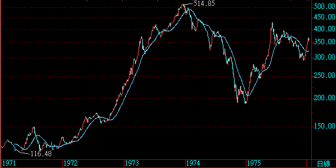
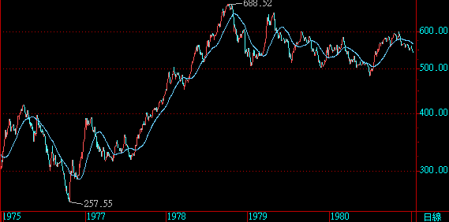
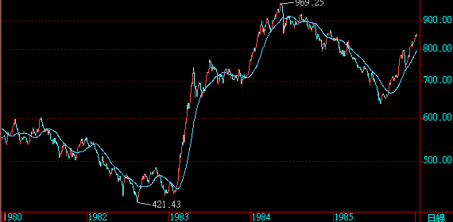
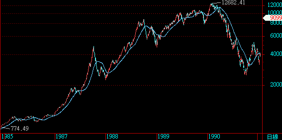
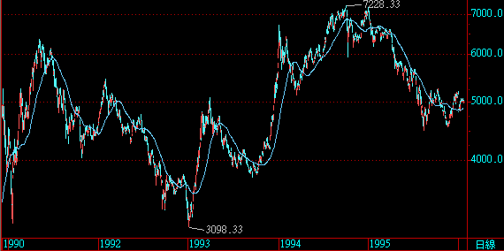
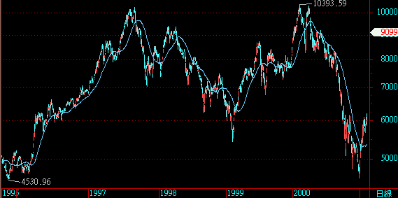
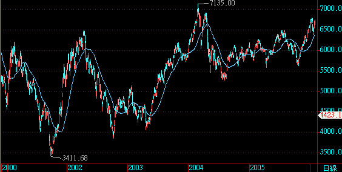
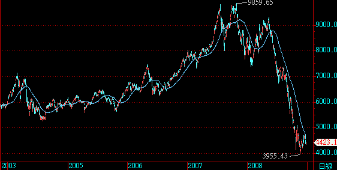
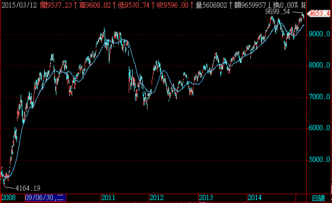
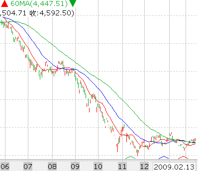

# 一條鞭法

重劍無鋒，大巧不工。其實一條線就可以讓人抱到很多個千點行情，不論是向上或向下；只是太簡單的技巧反而難以去實踐，一般人浸淫市場越久，越難視短期波動如無物。以下為台灣加權指數+60ma線圖，五年為一期：

線圖拉遠了，感覺是不是整個不一樣？每天的波動看起來就跟小漣漪差不多。只會這招沒辦法讓你荷包滿滿，但市況不對的時候，至少不會賠到屍骨無存。如同海龜法則，交易者要對抗的其實是自己的心。

### Follow the trend, not predict it

下面這段文是在2008年金融海嘯後的底部區發表的文章，可以給大家當作歷史借鏡：

對新手而言，「季線以下不作多」是最簡單的保命之道，我想附圖可以解釋一切，只要照著簡單的原則走，這波5000點下跌，基本上不會受什麼傷。

積極的人甚至可以沿路放空，而保守的人只需要等待，再等待，等待融資減幅超越大盤，等待無量崩跌，或者等待大量股民因為暴跌而崩潰，需要看醫生的新聞。

在將近半年兇猛的下殺後，指數從10月底已經從下跌趨勢，逐步轉為整理。從均線的角度，之前的數波反彈，面對月線季線的高扣抵，帶給投資人的只是一次又一次的失望。

伴隨著走勢陷入膠著，均線也開始收斂，目前季線扣抵在11月中的下跌段，也就是說，只要這兩個星期能撐在4500之上，季線就有機會從長線壓力轉變為支撐，但這仍待指數本身的表態。

為什麼每次高點都會套牢那麼多人？因為他們忽略價格的趨勢可能已經逆轉，堅持「看多」，目前由於長期的下跌，大多數的人對「趨勢向下」已經有了預期，若是指數之後往上突破，放空似乎就不是個好選擇，這樣很容易掉進和那些住套房者相同的心理陷阱。

這幾個月幾乎聽不到好消息，金融海嘯不知道要持續到何年何月，但跌深就是就是最大的利多，行情總在絕望中誕生，在半信半疑中成長，在激情中幻滅。

