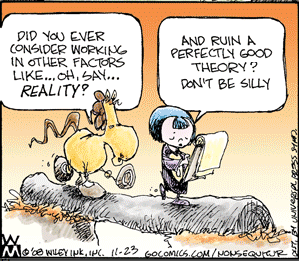

# 神準指標

Q：請問各位股市先進，都是以哪種技術分析指標為標的？我是新手，適合看哪些技術分析呢？

PS.最近有個紅綠燈指標好像還不錯，可以參考嗎？

A：藉著網路發達之助，現在很容易就可以在Youtube之類的網站上，找到NBA球員們的精選輯。在精選輯中，每個球員看起來都神勇無比，怎麼投怎麼進，但球員們實際在球場上的表現卻天差地別。投顧老師在電視上看起來似乎也永遠神準無比，但遺憾的是，那些老師通常不是真的準，是「只把準的部份秀給你看」，反正會員簡訊發個幾十檔股票，總有一兩檔會漲，「精選範例」就是老師們的聖杯。現在很多投顧老師的分析和簡訊，事後都可以在網路上找到，我自己看過幾個，感想只有三個字：「夭壽喔」，至於是夭壽準還是……讀者們有興趣的話，可以自己去找找看。

坊間在講交易的書籍多半也是運用同樣的招數，為了吸引目光，這些書的書名通常會有致富兩個字，副標獲利的單位通常是千萬；翻開書皮之後，字數通常不多，主要是靠大量的線圖來充頁數，若是講指標，通常只會列出成功範例，還都是最經典的範例，動不動就是賺個幾十趴。讀者讀了那類書之後，一開始通常會躍躍欲試，想說自己也可以像書中所寫的那樣快速獲利。但讀者不知道的是，在真正的市場競賽中，停損才是常態。

那類書絕對不會跟你談「全體樣本」，只有「精選範例」，老實說只要你能夠選得到超級大飆股，任何一種趨勢指標都可以幫你大賺，但是「怎麼挑」才是真正的關鍵。如果你亂槍打鳥，看到書中所授的訊號就跳進去，以一般的趨勢指標來說，勝率有三成多大概就要偷笑了，最後真正能大賺的比率恐怕只有一成，當關鍵飆股出現的時候，你的持股比率又會是多少？會不會因為有太多類似的訊號發出，導致你只持有極少量，甚至完全沒持有那檔股票，這些因素才是交易報酬率的關鍵，可惜這些書中都不會講，不然就沒賣點了。

總之我是沒碰過超準指標沒有最佳化的啦！針對特定歷史資料最佳化，結果就是套在其他地方統統拉屎。我覺得這個自己跑一跑資料就會有初步概念了，如果你能找得到沒最佳化就可用的神準指標，那就真的是聖杯了，恭喜恭喜。

