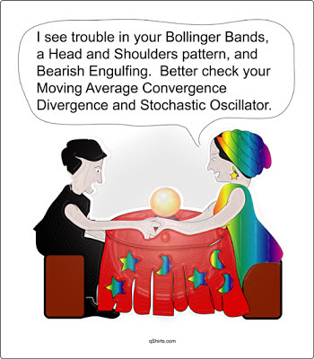

# 技術分析要設防

要在市場中生存，你必須學習生活在一連串的意外當中，學習在不確定的狀況之下做出決策，同時承擔極大的壓力。價格走勢就像天氣一般陰晴不定，如同氣象預報提供的只是機率，短期的價格走勢幾乎純屬隨機。但有些人總企圖要「解釋天氣」，把一些其實毫不相干的點和線連結起來，並將各種原本應該屬於隨機的型態、支撐與壓力賦予意義，並且相信這些型態具有預測未來走勢的能力。

隨便翻開一張線圖，我們都可以在其中找到各種型態：箱型、旗型、頭肩頂、頭肩底……而在眾多的技術分析方式當中，最傳奇的大概就屬K線了，故事是這樣開始的：日本的米商用開高低收四個價格，把每日的價格繪製成一連串的圖形，企圖藉此預測價格。這個方法後來被廣泛的運用到幾乎所有的商品上，台灣投資人在幾乎所有的股票軟體上，預設的線圖都是K線。許多人出了專論K線的書，列出幾十種不同的組合，聲稱這些組合一但出現，隨後就會有相應的多頭或空頭走勢。

這些理論聽起來很美好，但主要的問題是，幾乎沒有任何關於圖形的技術分析，能夠禁得起嚴格的檢視，所有主流型態都被學術界以歷史走勢統計過，結論很一致：沒有用。我們在那些理財雜誌、技術分析書籍中看到的那些例子，幾乎都是「精選範例」。其實人人在事後都可以找到線圖中的轉折，箱型，和支壓，可惜的是這總是只在「事後」才看得出來，至少我沒認識或聽過誰，可以在「事前」不斷提出準確的預測，這些分析絕大多數都是後見之明。有興趣的話，可以去圖書館找過期理財雜誌裡關於個股走勢的分析，然後跟之後的走勢比較，相信你會對那些「分析」有更深刻的體會。

如果各位認為學術界和實際的金融操作嚴重脫節，依然想要使用「市場專家們」所採用的技術分析來預測走勢，我想提幾個在運用之前，需要思考的問題：

### 支撐與壓力

出現折返時，要出現多大的折返才算有效？0.5%？1%？5%？10%？非支撐壓力區的折返走勢，和支撐壓力區出現的折返走勢有什麼差別？如果無支撐壓力區出現折返時，會被視為隨機，那為什麼支壓區及其附近的折返，卻會被視為非隨機？特別是在槓龜率這麼高的狀況下……

### 箱型理論

使用箱型理論的人，看起來準確度很高，但這其實都是假象，因為用箱型預測的時候，只要設定一個夠大的區間（ex：+3%～-3%），就可以確保自己大部分時候是對的。舉個比較極端的例子，若在台股的日走勢當中，把箱型區間設定為+7%~-7%，準確率會高達100%，長期走勢也是一樣的狀況。

### 時間轉折

最有名的費氏數列—1、1、2、3、5、8、13、21、34、55……很美妙，很有規律，實際運用時要是看小時、看日、看週、正負誤差3，那麼大部分折返都能抓到。但是我自創一個2、7、9、12、15、20、31、39、44數列，準確度看起來好像還是不錯？

### 型態

全世界都知道要W底作多、M頭放空，目標是測等幅，但是這個說法的依據在哪裡？的確，很多股票的走勢在事後都可以看出M頭和W底，但是若深入去檢視，其實有更多失敗的M頭和W底隱藏在線圖當中，其他的型態也有類似的問題。

我想這類分析能夠持續生存的關鍵是，只有線圖才能讓分析師每天更新分析內容。由於公司的營收一個月才發表一次，財報是每季一次，因此基本分析者無法經常更新分析內容，也沒有多少人願意付錢給個把月才會更新一次訊息的分析師。但價格圖形就不一樣了，每個交易日都會有新的價格走勢出現，分析的尺度甚至可以縮短到以分鐘計，而且圖形十分直觀，只要有一隻紅筆和一把尺，每個人都可以在圖形中找到無數的型態，隨時都會有新的標的可以提供給大眾，這給了分析師生存的空間。

國外曾經有人訪問某位在某小交易所的交易冠軍，他是個看起來很普通的老頭，記者問冠軍有沒有什麼訣竅，他神秘兮兮的從懷裡拿出一個硬幣，說道：「這是我的幸運硬幣，我每次進場都靠它決定多空，正面作多，反面做空，但是當天虧損的話我就會把部位出清，就是這樣而已。」說穿了，技術分析就是交易員們的硬幣。**絕大部分的技術分析，在統計檢定下都會露出原形，雖然過去有效的東西在未來不見得有效，但是在過去無效的東西在未來就會變得有用？若想靠大家都知道的技術分析方法來預測走勢，效果恐怕還不如一枚銅板。**

