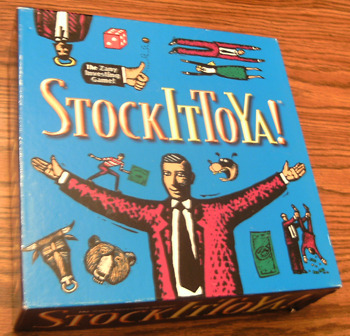
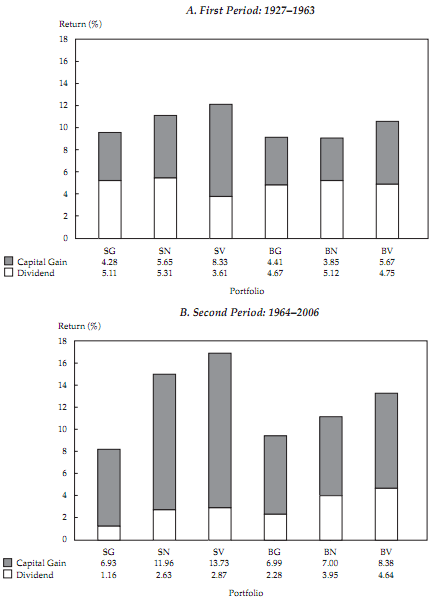
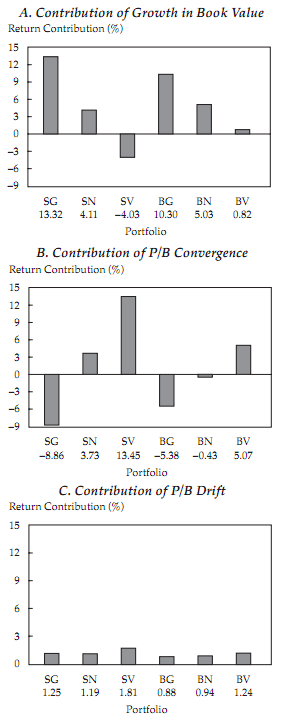
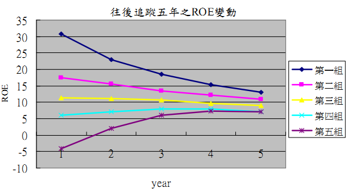

# 遊戲的本質

假設把台灣所有的上市櫃企業當作一家公司，而所有的投資人都擁有一小部分的股權，技術上投資人可以靠你賣我、我賣你的換手遊戲，把股權的價格炒到宇宙盡頭去，在這個過程中，大家都覺得自己變有錢了。但所謂的市值，不過是個虛幻的數字，**交易本身不會產生任何價值**。  
  
在1987年10月的股市大崩盤時，Wal-Mart的創辦人Sam Walton所持有的Wal-Mart股票，其市值大跌了30億美金，只剩下48億美金。這時有記者詢問他的看法，他的回應相當有趣：「這不過是紙上財富，從一開始就是，以後也是。\(it's paper anyway. It was paper when we started and it's paper afterward.\)」。

### **股票獲利的剖析**

Eugene Fama and Kenneth French在2007年提出的「[The Anatomy of Value and Growth Stock Returns](http://www.cfapubs.org/doi/pdf/10.2469/faj.v63.n6.4926)」這篇論文中，分析了價值\(低P/B\)與成長股\(高P/B\)報酬的來源，他們將1927-2006所有美國股票依\*規模和P/B，分為大型價值\(BV\)/大型中立\(BN\)/大型成長\(BG\)/小型價值\(SV\)/小型中立\(SN\)/小型成長\(SG\)，共六組；再把1926-2006年間價值股和成長股的平均回報，拆解成股息\(Dividend\)和資本利得\(Capital gain\)兩部分：  
  
\*占總組合比例：大型50% / 小型50%。價值30% / 中立40% / 成長30%。  
  
股息：Fama and French把研究期間分為兩段，下圖是各組在兩段期間中，股息和資本利得的比率。可以看到價值股在1964-2006年間，相較成長股有較高的股息殖利率，但在1927-1963年間，兩者的股息殖利率相當接近。

資本利得：為了方便理解，他們把資本利得拆解成以下三種型式：  
  
A. 由保留盈餘形成的淨值成長；  
B. 價值與成長股之間P/B的收斂\(主要是因公司獲利和預期報酬的平均數回歸\)；  
C. 整體市場P/B的提升。  
  
**股息和淨值的成長屬於公司的實際獲利，其他兩者則反映出投資人對未來的預期**，下圖統計了各組合的資本利得分配：  

市場P/B的提升在各組合當中都很接近，先略過不談。  
  
由圖可知，價值股淨值的成長較低，小型股族群甚至是負的，價值股的資本利得來源主要是P/B的上升。相較於價值股，成長股傾向把盈餘保留，淨值成長率也較高，但整體的P/B是下滑的，由於這兩者互相抵消，資本利得的成長會低於公司淨值的成長。  
  
接下來他們以經濟的驅動力，來解釋P/B在成長與價值股間的消長：當公司被區分為價值和成長股時，其資本利得的形成方式也相反。成長型公司整體來說獲利較高且成長快速，價值型公司則相反。投資人對成長股營運的樂觀預期，造就了成長股的高P/B和價值股的低P/B。  
  
然而來自其他公司的競爭會侵蝕成長股的高獲利，因此每年都有些成長股失去光環，因此成長型公司組成的投資組合，P/B傾向下滑；價值股由於公司整體的獲利能力改善，P/B也跟著上揚，他們把這個情形稱為P/B的「收斂」。  
  
熱門的成長公司很好，只是通常沒有好到讓股價可以一直待在雲端，套句Peter Lynch的名言：「高價投資一家非常成功的企業，是最令人覺得喪氣的悲劇，因為公司雖然賺大錢，你卻繼續賠錢。」  
  
附帶一提，獲利回歸平均數這個現象在台灣也看的到，可以參考「[我國上市、櫃公司股東權益報酬率之習性分析](http://ndltd.ncl.edu.tw/cgi-bin/gs32/gsweb.cgi?o=dnclcdr&s=id=%22094YUNT5121029%22.&searchmode=basic)」這篇論文，作者張鈺雯統計了1985-2004年台股上市櫃公司的ROE數據，結果如下圖所示：  

從圖中可以發現ROE有強烈的回歸平均數性質，即高ROE的公司因為市場競爭，未來的ROE傾向下滑，低ROE者在經過市場淘汰後，則會上升。值得注意的是，各組別之間的ROE雖然拉近，但不會出現逆轉；這是因為大部分的公司營運有延續性，市場裡雖然永遠不乏浴火鳳凰和墮落天使，但整體而言仍是呈現強者強、弱者弱的格局。

### **遊戲的本質**

交易是場迷人的心智遊戲，有紀律的投資人在這場遊戲中，或許可以靠買低賣高得到超額利潤，但你多賺的就是別人少賺的，**到頭來，投資人全體能獲得的報酬只有一種：企業的盈餘。**價值投資說穿了，不過是低買者賺殺低者的錢，高賣者賺追高者的錢而已。  
  
最後送大家一首歌，[Kenny Rogers的The Gambler（Youtube連結）](https://www.youtube.com/watch?v=kn481KcjvMo)：  
  
'You got to know when to hold 'em, know when to fold 'em,  
Know when to walk away and know when to run.  
You never count your money when you're sittin' at the table.  
There'll be time enough for countin' when the dealin's done.'

