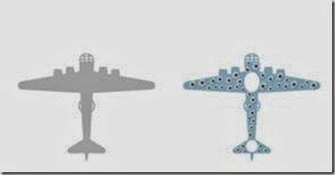

# 量化分析雜談

這篇文章原本是網路上的討論，原始討論串已經沒了，但內容我覺得不錯，所以貼上來分享，不只是基本分析，技術分析回測時也可以思考這些點：

### 量化分析的偏誤與限制

在這篇的討論，貓大談了一些回測要注意的事情，以及量化分析的限制及量化投資方法，貓大本身就是一位偏向量化的投資人，也看了很多回測的相關資料和研究，『』裡的是貓大的原文。  
  
\*貓大是我在某些地方的外號  
  
在談到指標選股時我們常會用到回測來驗證方法的可行性，然而回測有幾個可能出現偏誤的地方：

1. 時間延遲偏誤： 年報與季報並不是該季結束馬上公佈，如果在尚未公佈前就使用該資料\(ex：一、二月就使用去年全年EPS\)就會有時間上的偏誤 
2. 資料偏誤： 如果資料庫有錯誤就會有這類偏誤，通常是使用公信力高的資料庫來避免此類偏誤。 
3. 交易成本偏誤： 大部份的回測並沒有考慮到交易成本，這對於越短期的交易策略影響越大。 
4. 倖存者偏誤： 由於回測是回頭看，很多下市公司會被忽略，這會造成整體回測的報酬率提高。 
5. 樣本偏誤： 有些研究並不是使用母體來做回測，而是使用一小部分的樣本來代替母體。如果取樣的不夠好就會有此類偏誤，例如我們抓儒鴻、台積電、研華的成長率當作全台上市櫃公司的成長率，這樣就會有樣本的偏誤。 
6. 回測時間偏誤： 這主要是在講採取的時間不夠長，例如拿2009-2011股市報酬當作股市的長期報酬。所以不會用這麼短的區間，而會選擇長期幾十年來做回測。

上面是我現在想的起來的幾種偏誤，名詞可能不是很正確。在前面的討論貓大主要在講倖存者偏誤及為什麼注意這類偏誤這麼重要。  
  
例如我們現在要回測一種策略——買進股價10元以下公司，持有5年賣掉。如果我們沒有考慮倖存者偏誤，很有可能就會認為這是一個好策略，因為我們只看得到那些現在還能存活、甚至度過危機可以成長的公司，卻看不到那些無法度過危機而下市的公司。  
  
接下來討論到用能不能用量化分析來判斷公司未來的成長，貓大說：  
  
**『像雷大提到借殼公司的例子，我認為沒有人可以從當年的量化財務資訊中，知道八年十年後，公司會迎來怎樣的轉機』  
  
『要做這類分析最好用財務資料而非股價，單看股價只會看到十年前股價很囧現在股價很威的公司，那些不錯但現在被低估或十年前剛好較貴的公司，就這樣消失在歷史洪流裡了』  
  
『我們沒辦法從十年前的數字預測幾年後的原物料大行情，這幾年開始發達的：如2013裡的漲幅王儒鴻吃到uniqlo、lativ大單變機能衣王也是如此，十年前的財務資訊無法看出這些』  
  
『有長期競爭優勢的公司\(護城河\)通常都有高ROE，但有高ROE的公司通常有護城河？我的想法是NO』**  
  
塞斯卡拉曼提到投資的獲利來源有兩種：「評價的提升」、「內在價值的提升」，純量化的分析只能賺到前者，賺不到後者。因為內在價值要持續提升需要強大的護城河，而護城河卻無法從量化分析中判斷出來，這也是為什麼會需要質化分析的原因。它可以讓我們判斷內在價值會不會持續提升，純量化的分析也可以是價值投資，只不過我們要知道純量化分析的限制所在。  
  
貓大說：  
  
**『靠質化分析都很難找出未來十年的高成長公司，純量化就更困難了』  
  
『ROE的均值回歸現象\(也可以說經濟競爭\)遠比一般人想像要強大，基本上三五年就會把大部分現在的優質公司從雲端拉下來，這只要去看2000-2013年各年高ROE公司前十趴的重複率就很明顯，即使排除那種一次性收入還是很明顯。我自己從十幾年前就開始以ROE做初步篩選，看過太多』**  
  
貓大是一位偏向量化分析的投資人，質化分析的比重沒有雷大或尼莫大那麼多，因此他會做許多回測或看別人的研究來擬定策略：  
  
**『我否定量化的財務資料預期長期股價報酬的能力\(一兩年ok，即value premium\)』  
  
『如果持有低pe/pb之類的價值組，每半年/一年/兩年重組，長期超越市場的機會很高。但十年重組一次，就比較不合理』**  
  
**『我覺得投資組合超分散甚至純量化也OK，但是越集中質化分析越重要，因為你犯錯空間變小』**

最後補充一下，在回測時排除倖存者偏誤這件事，特別重要的理由。先來說個故事：1941年，第二次世界大戰期間。有一天，美國哥倫比亞大學著名的統計學家沃爾德教授\(Abraham Wald，1902-1950\)，來了一個意外的訪客，那是英國皇家空軍的作戰指揮官。他說：「沃爾德教授，每次飛行員出發去執行轟炸任務，我們最怕聽到的回報是：『呼叫總部，我中彈了』。請協助我們改善這個關係著飛行員生死的難題吧！」沃爾德接下這個緊急研究案，分析德國地面砲火擊中聯軍轟炸機的資料，並且以統計專業，建議機體裝甲應該如何加強，才能降低被砲火擊落的機會。但依照當時的航空技術，機體裝甲只能局部加強，否則機體過重，會導致起飛困難及操控遲鈍。  
  
沃爾德的研究發現，機翼是最容易被擊中的部位，而飛行員的座艙與機尾，則是最少被擊中的部位。

### **太重視「看得見的」，反而做出錯誤決策**

沃爾德詳盡的資料分析，令英國皇家空軍十分滿意。但在研究成果報告的會議上，卻發生一場激辯。負責該專案的作戰指揮官說：「沃爾德教授的研究清楚的顯示，聯軍轟炸機的機翼，彈孔密密麻麻，最容易中彈。因此，我們應該加強機翼的裝甲。」  
  
但沃爾德卻堅定而客氣的說：「將軍，我尊敬你在飛行上的專業，但我有完全不同的看法，我建議加強飛行員座艙與機尾發動機部位的裝甲，因為那兒最少發現彈孔。」  
  
在全場錯愕懷疑的眼光中，沃爾德解釋說：「我所分析的樣本中，只包含順利返回基地的轟炸機。從統計的觀點來看，我認為被多次擊中機翼的轟炸機，似乎還是能夠安全返航。而飛機很少發現彈著點的部位，並不是真的不會中彈，而是一旦中彈，根本就無法返航。」指揮官反駁說：「我很佩服沃爾德教授沒有任飛行經驗，就敢做這麼大膽的推論。以我個人而言，過去在執行任務時，也曾多次機翼中彈嚴重受創。要不是我飛行技術老到，運氣也不錯，早就機毀人亡了。所以，我依然強烈主張應該加強機翼的裝甲。」  
  
這兩種意見堅持不下，皇家空軍部部長陷入苦思。他到底要相信這個作戰經驗豐富的飛將軍，還是要相信一個獨排眾議的統計學家？  
  
**【答案】**  
  
由於戰況緊急，無法做更進一步的研究，部長決定接受沃爾德的建議，立刻加強駕駛艙與機尾發動機的防禦裝甲。不久之後，聯軍轟炸機被擊落的比例，果然顯著降低。為了確認這個決策的正確性，一段時間後，英國軍方動用了敵後工作人員，收集了部分墜毀在德國境內的聯軍飛機殘骸。他們中彈的部位，果真如沃爾德所預料，主要集中在駕駛艙與機尾的位置。

