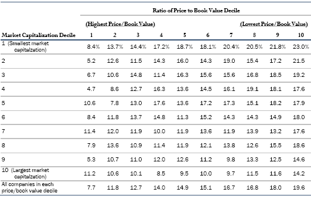
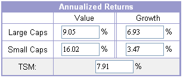

# 價值投資：煙屁股有多好？

若你想成為一位價值投資者，那你可以遵循以下兩個簡單的法則篩選股票：

1. 用極端低廉的價格去購買一般的公司（低PB/PE/PS/PCF）
2. 用合理的價格去購買優質的公司（高ROE/ROA/ROC+合理的PB/PE/PS/PCF）

\*PB：股價淨值比 / PE：本益比 / PS：股價營收比 / PCF：股價現金流量比

第一種方式的老祖宗就是Benjamin Graham，他在1934年所著的「證券分析」到現在都還是價值投資的聖經之一。那時的證券市場還不像現在如此成熟，也沒有所謂的證券分析師，他開創了藉研究財務報表來評價股票的先河，而他經營的Graham-Newman Fund，績效也遠超過同期間的指數，這段期間包括讓無數人傾家蕩產、流離失所的大蕭條。  
  
Graham曾經說過：「**股價以短線來說是投票機，以長線來說是體重計。**」短期股價經常會背離企業本身的價值，市場越不理性、極端價格越常見，抱著購買優質企業的精神的投資人機會越多。他認為在投資時，要挑選擁有優異的盈餘歷史、借款比率低、有能力配發股息的股票。除此之外，市值最好遠低於淨值，能夠低於公司的淨現金更好，因為這些股票長期多半可以回到淨值，即使最後被清算也有機會獲利。  
  
這套方法直到現在還是被許多價值投資人奉為鐵律，但購買低於淨值的股票這招，後來被Warren Buffett戲稱為煙屁股投資法，癮君子可以從地上撿些煙屁股來抽，但抽沒幾口就得丟掉。他是這麼說的：「**如果你用很低的價格買進某家公司的股票，短期有機會以不錯的價格獲利了結，但長期這家公司的經營業績可能會很糟糕。**」  
  
話雖這麼說，但早期他同樣奉行這種煙屁股投資法，其合夥基金以及早期的Berkshire，其投資報酬率甚至高於後期的Berkshire。Buffett直到1970年代中期，Berkshire已經成長的太大，不再適用這個方法之後（因為煙屁股大部分是小型股，本小的時候還可以買低賣高賺賺差價，錢多時除非要入主重整，大量購買很容易陷入流動性陷阱），才接受Charles Munger的建議，轉而學習Philip Fisher，重視企業的利基與ROE，並願意接受以較高的本益比買進，以長期持有來換取企業的成長。  
  
如果你是效率市場的支持者，大概會對以上的說法嗤之以鼻，因為根據理論，市場價格已充分反應了所有的公開資訊，所以投資人無法藉著基本面分析來獲得超額報酬。但有趣的是，提出效率市場理論的Eugene L. Fama（[綠角](http://greenhornfinancefootnote.blogspot.com/)有[專文](http://greenhornfinancefootnote.blogspot.com/2007/07/eugene-fama.html)介紹）在1992年提出的「[The Cross-Section of Expected Stock Returns](http://home.business.utah.edu/finmll/fin787/papers/famafrench1992.pdf)」這篇論文中，提出了著名的三因子模型。這個模型簡單來說，就是影響股價報酬的因素，除了市場走勢之外，還有「規模」與「價值」：**小型股優於大型股，價值股優於成長股。**  
  
下表簡單說明了Fama and French的研究成果，他們將1963-1990年中所有在NYSE、AMEX、NASDAQ上市的股票（排除金融類股），以市價淨值比（橫軸）和市值規模（綜軸）為分類做十等分切割，共一百個投資組合。每個投資組合裡面的個股都以\*等權重（Equal-weighted）方式處理。  
  
\*等權重：和一般指數編制時所採用的市值加權（Capitalization-weighted）方式不同，在投資組合裡不同個股的投資金額均相同。舉例來說，如果一個等權重投資組合有20檔個股，不論個股的市值比例為何（像台積電跟松翰的市值差距目前超過100倍），每檔股票均投資5%。

由表中可以清楚的看到，在十種市值分類中，低PB的股票都顯著擊敗了高PB的股票，而且最小市值和最低PB的組合報酬率最高。但值得注意的是，相對於價值選股，\*小型股效應並沒有那麼穩定，作者的結論是「在交叉分析中，市價淨值比是最能持續解釋平均股價報酬的因子」。  
  
\*[散戶投資正典](http://www.books.com.tw/exep/prod/booksfile.php?item=0010415308)（Stocks for the long run，書名翻的很爛）第九章有更詳細的說明，扣掉1975-1983這段期間，小型股並沒有顯著優於大型股。  
  
或許有人會覺得一個過去有效的方法，在被揭露之後就會失效。不過French教授在自己的[網站](http://mba.tuck.dartmouth.edu/pages/faculty/ken.french/data_library.html)上有持續在更新資料，我們來看一下1993-2005之間的價值與小型股效應：

看來效果還是不錯，對吧！有興趣的人可以去[moneychimp](http://www.moneychimp.com/articles/index_funds/index_portfolios.htm)看一下各個歷史區間的報酬率。（有1927-2005的歷史資料，資料來源一樣是French的[網站](http://mba.tuck.dartmouth.edu/pages/faculty/ken.french/data_library.html)。如果不是英文苦手的話，強烈推薦把整個站看完，同是index fund的支持者，[綠角](http://greenhornfinancefootnote.blogspot.com/)沒有專文介紹這個網站還蠻可惜的）

