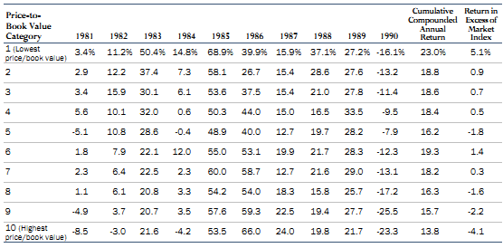
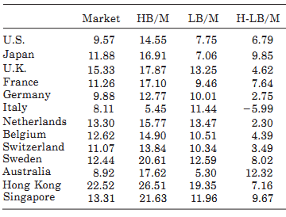
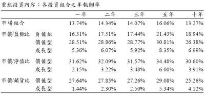
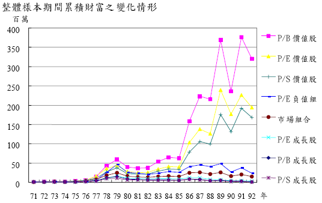

# 成長與價值

上篇提到的都是美股，勢必會有人懷疑這套方法在國際市場的效果，接下來再讓我們看幾篇針對全球股市的研究。要特別注意的是，這些論文裡面的「成長」與「價值」跟一般的認知不同，只代表某種比率高或低而已，例如下面的研究中PB低的為價值股，PB高的為成長股。  
  
Barton Biggs（Hedgehogging，中文書名「[上億資金怎麼玩](http://www.books.com.tw/exep/prod/booksfile.php?item=0010395764)」的作者—又是一本好書配上爛譯名）於1990年提出了「Ben Graham Would Be Proud」 這篇研究報告。作者分析了MSCI資料庫中的所有股票，其中約只有20%是美股，研究期間從1981到1990年。這篇報告一樣把這些個股按照PB排序分為十組，每年重組一次，基準指數為MSCI global equity index。其研究結果顯示，最低PB組與最高PB組的年化報酬率差異為9.2%，而最低PB組高於基準指數5.1%，如下表所示：

而在Fama and French在1998年所提出的「[Value versus growth: The international evidence](https://umdrive.memphis.edu/ywu/www/business/Investment%20Theory/4%20The%20Efficient%20Markets%20Hypothesis/Over-reaction%20and%20Momentum/FF_valuevsgrowth_intern_JOF98.pdf)」這篇論文裡，摘要的第一句就是「Value stocks have higher returns than growth stocks in markets around the world. （**在全球股市中，價值股有高於成長股的投資報酬**）」。1975-1995年間，低PB和高PB所建構的全球投資組合，其年化報酬率差距為7.68%；在13個主要市場中，有12個市場的價值股表現超越成長股。下表是各國在研究期間內的數據，我們可以看到在研究期間內，除了義大利股市之外，其餘12個國家的低PB組合表現都優於高PB組合：

看了這麼多國家，各位看倌最關心的大概還是台灣適不適用這套方法。在「[價值型投資風格於台灣股票市場之研究](http://ndltd.ncl.edu.tw/cgi-bin/gs32/gsweb.cgi?o=dnclcdr&s=id=%22092NCCU5305014%22.&searchmode=basic)」這篇論文中，作者陳巧玲以民國71-91年所有的上市股票為對象，排除金融業、全額交割股和淨值為負的股票後，將個股依PB、PE、PS均分為五組後分析。以下是論文摘要的節錄：

1. 依據低PE、低PB及低PS所形成的價值型組合，績效表現均優於市場組合及成長型組合，其中又以PB之價值型組合最為突出。 
2. 不論處於多頭或空頭市場，價值型組合均能一致地擊敗市場組合及成長型組合。其中，空頭時期的價值效應較多頭時期明顯，此可能與價值型組合相對抗跌之特性有關。 
3. 不論貨幣政策為寬鬆或緊縮，價值型組合之績效表現大多均較成長型組合為佳，其中又以貨幣寬鬆時期之價值效應較為明顯。

接下來我們來看看在不同年數下重組投資組合的的效果：

低PB投資組合的年化報酬率為31.62%，好的有點誇張，對吧！（我知道飆股大師都是一年100%起跳的，別酸別酸）這告訴我們買進的價格夠不夠便宜很重要，所謂的買賣點不是看到突破就去追漲殺跌。  
  
下圖是假設在71年以100萬開始投資，每年重組投資組合的狀況下，資產的變化情形：

仔細檢視的話還可以發現一件有趣的事，就是PE負值這個組合的表現還比市場組合好！不過這個組合的風險（波動率）也比較高。另外這份論文未考慮稅和交易成本的問題，所以報酬率最好打點折扣。但話說回來，既然一年才換一次投資組合，結果不至於差很多就是。  
  
以上的研究告訴我們，至少在過去數十年間，價值溢酬現象普遍存在於各國股市，至於為什麼會有這種現象存在，最普遍的說法是**投資人對成長股過度樂觀，對價值股又過度悲觀**所造成。如果你相信人性始終不變，市場會週期性的陷入貪婪和恐慌，那你就可以考慮用類似的方式去建構投資組合（重點是十分簡單！），企圖獲得優於市場的報酬。  
  
但是要記得，價值需要時間去發酵，你可能在幾個月、一年甚至數年間持續落後市場，在逆境中能不能堅持下去，才是對價值投資者真正的考驗。

