# 做功課的方法

有心要學習的可以試著強迫自己固定花點時間去做研究，像在股版po認真的分析文也是一種方式。下面以一篇試自己做的分析作為例子，說明個股研究可以如何著手：

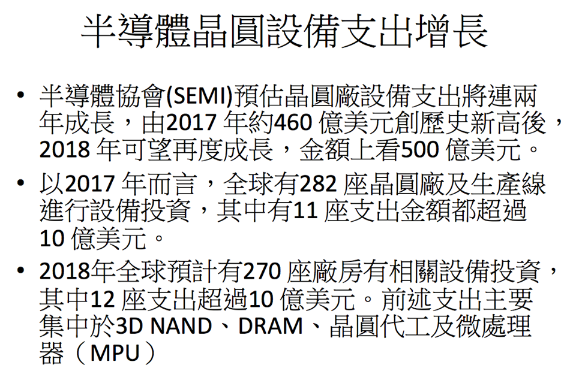

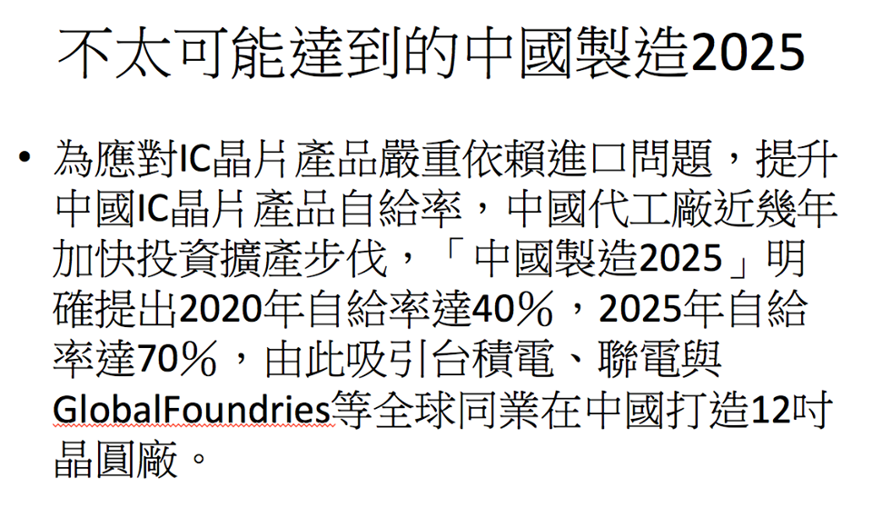

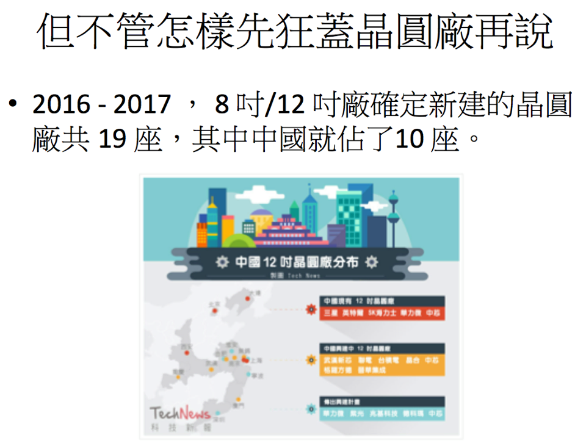

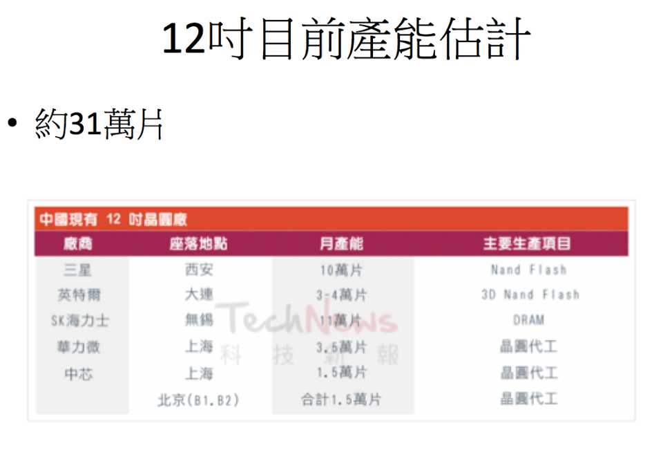

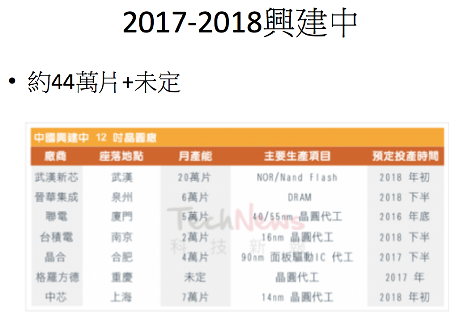

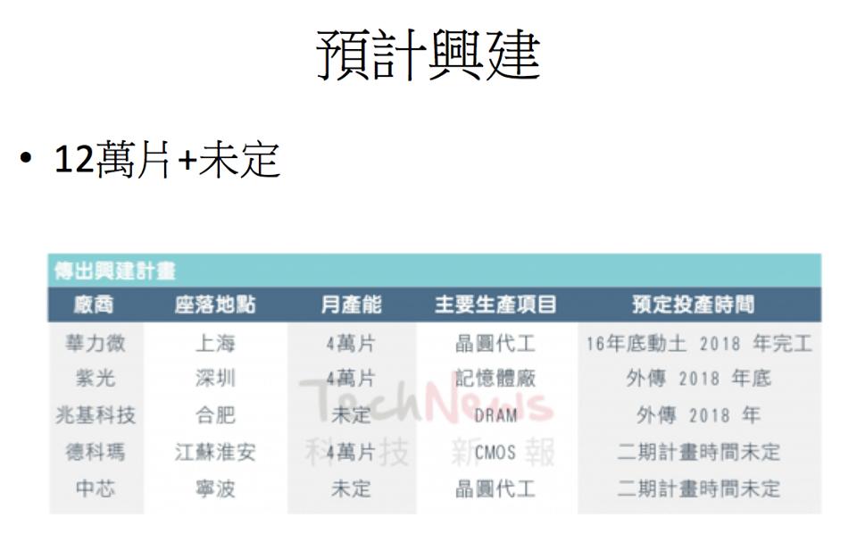

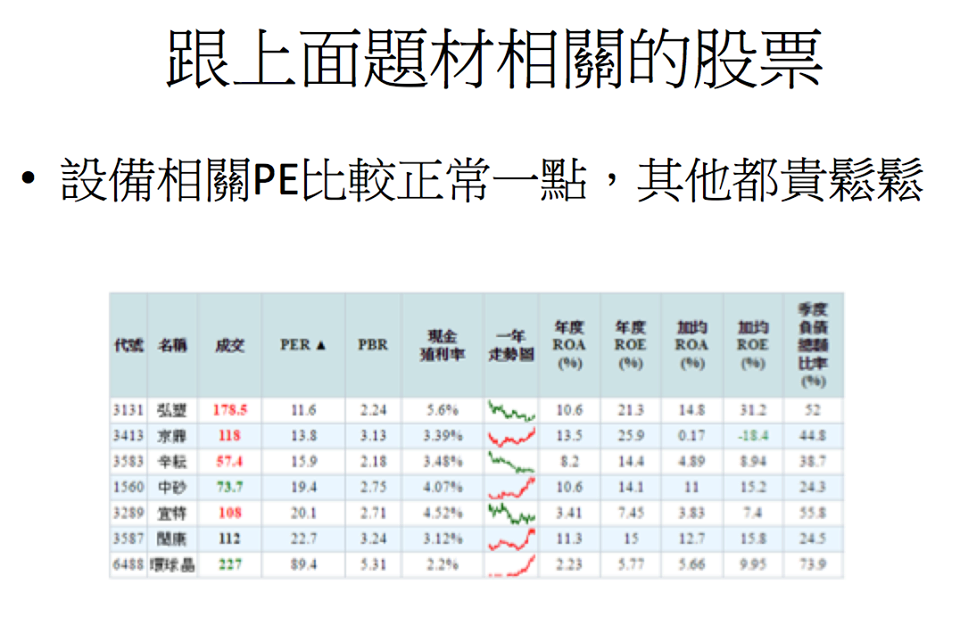

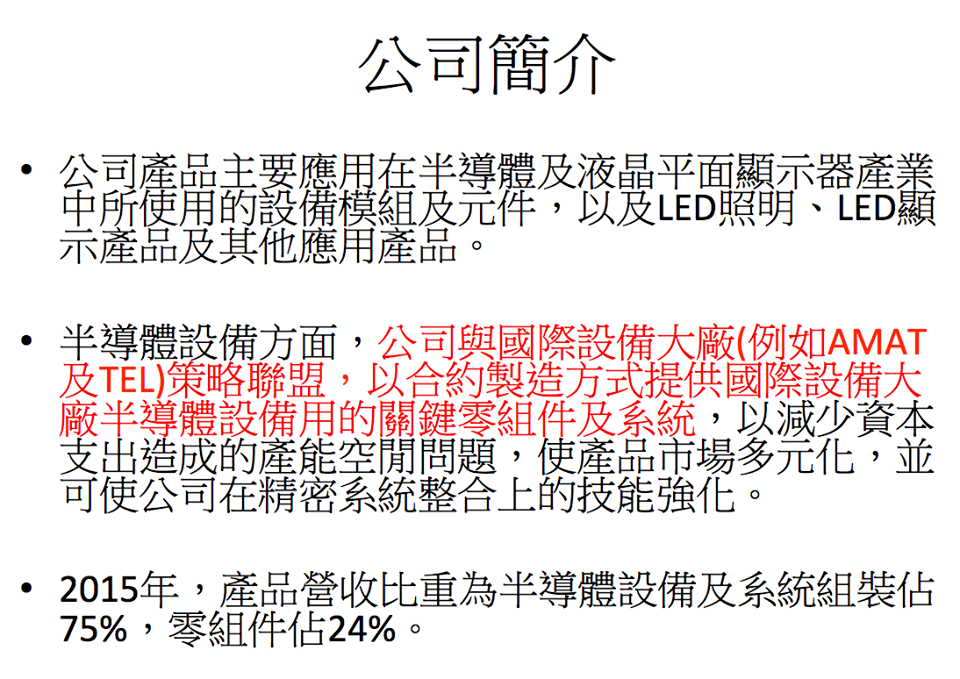

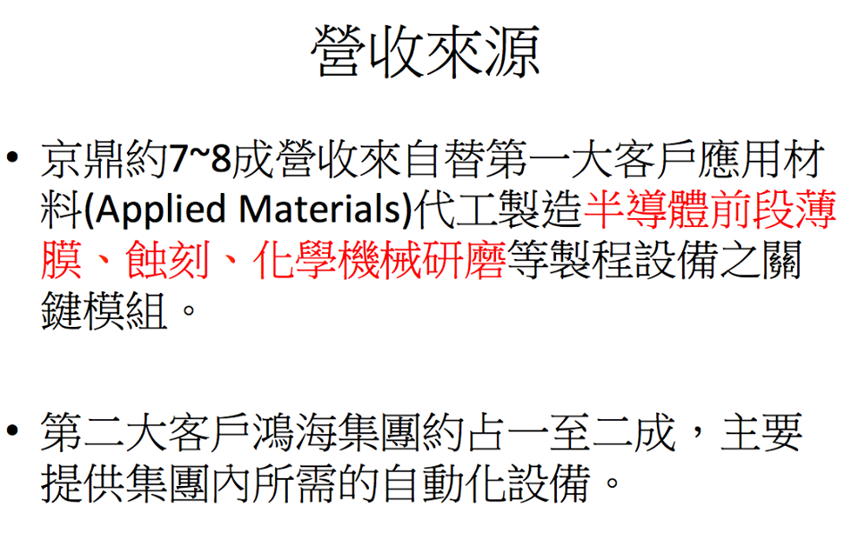

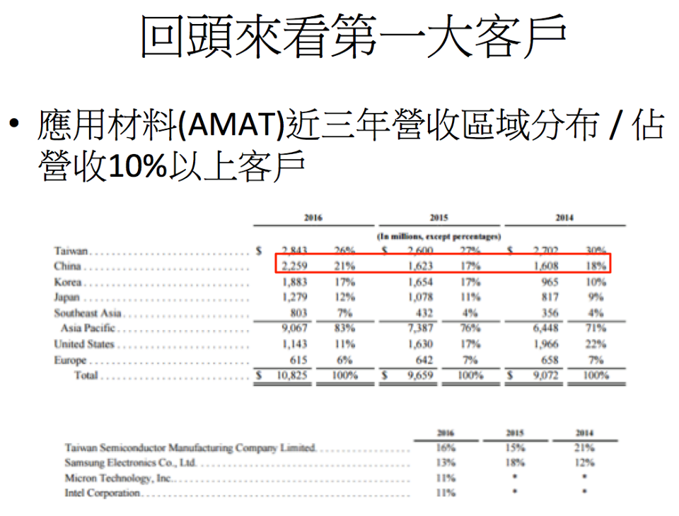

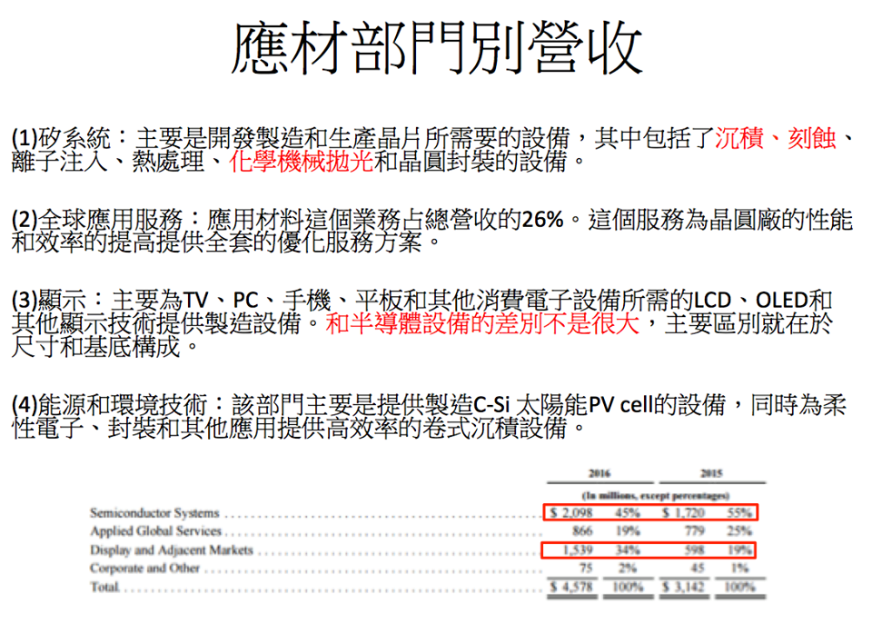

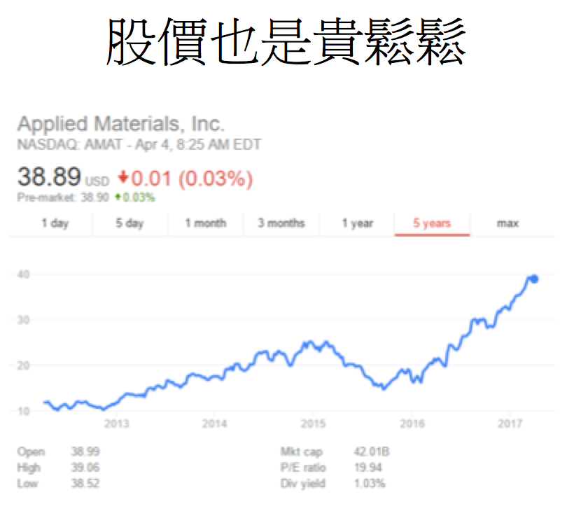

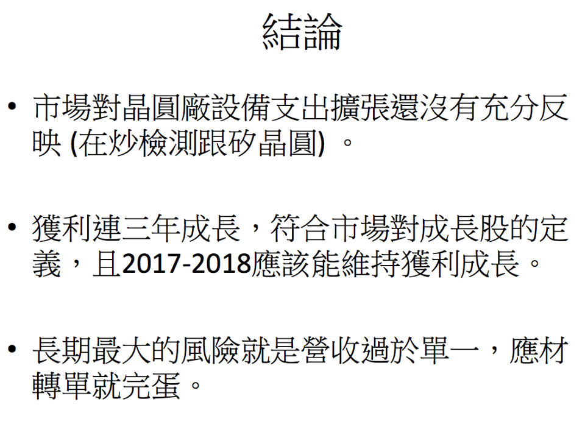

\*這是2017做的研究，內容已經不適用於貿易戰興起的現在  
  
當初會注意到是因為其中一個投資群組聊到宜特跟閎康，用「股票名稱」「研究報告」兩個關鍵字，就可以找到幾篇長篇分析文：

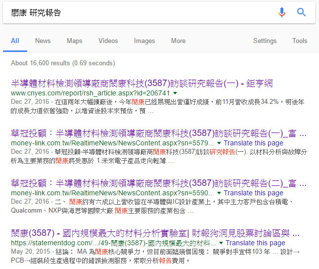

雖然覺得這兩檔本益比都過高，但背後半導體擴廠的題材激起了我的興趣，還是一樣用google搜尋「半導體」「擴廠」，就可以找到[這篇新聞](http://www.appledaily.com.tw/realtimenews/article/new/20170308/1071757/)。該篇新聞提到報告名稱World Fab Forecast，再用該關鍵字去搜尋可以找到[這篇報告](https://www.semi.org/en/news-resources/market-data/world-fab-forecast)。

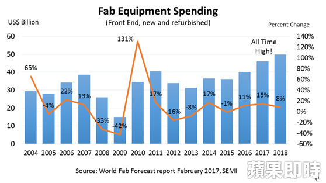

用「中國」「晶圓廠」「產能」當關鍵字則可以找到[這篇分析](http://technews.tw/2016/10/17/china-300mm-fab/)，只要簡單的計算就可以知道這幾年會有大量產能開出，照理說建廠時設備廠會先受益，產能開出後矽晶圓和檢測廠才會反應，但當時的相關類股的股價，卻是晶圓跟檢測提早反應，所以我就開始研究設備廠。

說到半導體設備廠，直覺會想到AMAT跟ASML這兩家，前者是全球最大，後者是擁有最先進製程EUV，還讓intel三星GG共同投資加速製程開發。google你會找到[這篇](https://zhuanlan.zhihu.com/p/21632080)還有[這篇](https://www.zhihu.com/question/42963443)，讀完可以對產業多些基礎認知，也會知道EUV中國目前還沒法進口，所以上面的中國2025題材，ASML恐怕受惠的程度較小。那就來看看AMAT吧，AMAT是美國上市公司，直接從官網就可以[下載財報](http://www.appliedmaterials.com/company/investor-relations/financials)：

從財報就可以找到營收最大成長區域\(中國\)跟最大客戶\(GG\)，再看一下在手訂單量，就可以知道上面講的題材不是唬爛的，而且AMAT的股價也持續在創新高。接下來就是找AMAT的供應鏈，搜尋「應用材料」「供應商」就可以找到好幾檔標的。其中我最有興趣的是3413 \(ROE最高 近年獲利持續成長\)，搜尋「moneydj」「京鼎」，就可以找到人家[整理好的簡介](https://www.moneydj.com/KMDJ/Wiki/wikiViewer.aspx?keyid=141d7096-8bb6-42c3-a23e-649c0eb7449a)再對照一下應材的主要營業部門Silicon systems

| 輸家散戶 | 贏家散戶 |
| :--- | :--- |
| 別人賺錢都攏系Lucky | 從別人賺錢的經驗中有什麼可學 |
| 我散戶，蝦米攏某 | 雖然我散戶，但我有什麼 |
| 只想知道暴賺秘笈，其他沒興趣 | 廣泛學習除了賺錢，也是一種樂趣 |
| 短期致富，幻想式的報酬率 | 合理且有機會達成的報酬率 |
| 先買進再說，股票慢慢認識就好 | 先深入研究，再找合理價位買進股票 |
| 股市是賭場，行運一條龍 | 股市是戰場，多算勝，少算不勝 |
| 期待 | 等待 |

