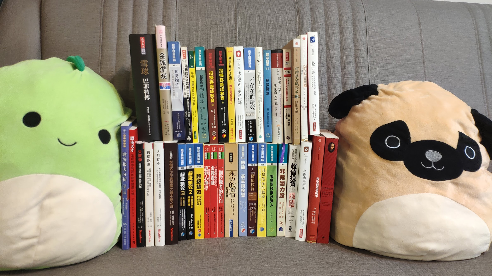

# 書、書、更多書

### 價值投資

[**彼得林區 學以致富**](https://adcenter.conn.tw/2bKfc)  
****[**彼得林區 選股戰略**](https://adcenter.conn.tw/2bKfA)  
****[**彼得林區 征服股海**](https://greenmall.info/2bKfV)  
  
****經典不用多介紹，又會投資，講話又超好笑的人不多，彼得林區是其中的佼佼者，一套三本由淺入深，股票六大分類極實用。  
  
[**21世紀價值投資**](https://product.mchannles.com/2ZzG9)  
  
這本書的前半段，主要介紹價值投資者衡量企業的三種主要方式：資產、盈餘、成長，後半段則介紹了8位價值投資人，每個人都有獨特的投資風格。[個人書摘的連結在此](https://stasistw.blogspot.com/2019/10/21.html)。  
  
[**你也可以成為股市天才**](https://www1.gamepark.com.tw/2bKkO)  
  
這本書特別之處在於講述的不是基本投資概念，而是用各種實際案例來說明分拆、合併、重整、套利等，只有少數投資人願意花時間研究的特殊事件，並從中尋找獲利機會。  
  
[**智慧型股票投資人**](https://wonderfulapple.net/2bKmo)  
  
葛拉漢的傳世經典，把股票市場當作投票機與體重機的比喻，至今為人津津樂道，這本書可以協助你建構一套以價值為基礎的投資策略。至於[證券分析](https://www1.gamepark.com.tw/2bKoN)上下集個人覺得偏硬，沒有會計跟投資學基礎大概會覺得是天書，自覺是老手的再考慮挑戰。  
  
[**非常潛力股**](https://idragon.info/2bKpu)  
****[**買股致富**](https://wonderfulapple.net/2bKq7)  
  
非常潛力股比較有名，但我個人反倒偏好買股致富，裡面關於法人股與企業併購的觀點，到現在還是頗貼切。  
  
[**失敗學**](https://www1.oeya.com.tw/2bKqV)  
  
主題非常特別，用大量的實際案例告訴你：企業是怎麼掛掉的。我喜歡作者觀察經營階層的方式。  
  
[**大利從小**](https://buyforfun.biz/2bKrX)  
  
最大的缺點是翻譯我不喜歡，但內容扎實。

### 量化價值

[**打敗法人的價值投資法**](https://dreamstore.info/2bKzX)  
****[**WHAT HAS WORKED IN INVESTING**](https://www.tweedy.com/resources/library_docs/papers/WhatHasWorkedFundOct14Web.pdf)  
  
這本書的內容雖然比不上「智慧型股票投資人」專業，卻簡潔扼要的抓住了價值型投資的精髓之處，書中說明要避開具有哪些特質的公司那段，看了令人會心一笑。What has worked in investing則可以當作「打敗法人的價值投資法」的免費英文版，內容集中在文獻回顧，用數據告訴你哪些方法在投資領域有用。  
  
[**超值投資**](https://buyforfun.biz/2QKcy)  
  
除了大量的回測數據外，本書最有趣的地方是詳述了Icahn、Graham、Buffett、Greenblatt等人的投資方式，不時比較這些名家觀點與做法中的異同，如何在量化與質化、煙屁股與優質公司做取捨；面對顢頇的公司經營階層，又如何藉「股東行動主義」來加速釋放公司價值。  
  
[**計量價值的勝率**](https://igrape.net/2bB6x)  
  
跟其他偏內容偏量化的價值投資書籍一樣，這本書提出了相當多的回測數據來說明採取價值投資方法的歷史績效。此外從建立checklist、指標的篩選、投資組合建構、到績效測試都有清楚的描述，若跟我一樣是數據控的話，應該會喜歡這本書。  

### 指數投資

\*漫步華爾街  
以大量的統計數據駁斥許多常見謬誤，也提供了相當實用的投資和資產管理建議  
  
\*散戶投資正典  
\*綠角的基金8堂課  
\*指數革命

### 專業投機

\*超級績效  
\*超級績效2  
\*超級績效3  
  
\*專業投機原理I  
\*專業投機原理II  
建議所有有志投機的人都要看，從經濟分析，統計技術 到心理與交易哲學都有詳盡的介紹，內容重複率稍高，可以只買一  
  
\*投資最重要的事  
\*掌握市場週期  
  
\*穩操勝算  
純線仙派和搞不清楚自己為何是超級反指標的人，都應該去找這本書來看  
  
\*史瓦格期貨技術分析上  
\*史瓦格期貨技術分析下   
開頭漫步派和技術派的爭論值得一看，書中詳盡的解釋了各種型態、指標所代表的意義，與良好系統的設計方法與評估，做做後面的自我練習，相信會對所謂的技術分析有些新的體會。  
  
\*趨勢交易正典：成為多空百萬贏家  
\*順勢操作：多元化管理的期貨交易策略

### 傳記箴言

\*雪球  
\*永恆的價值  
\*巴菲特：從無名小子到美國大資本家之路  
巴菲特傳記系列，我個人最喜歡第三本的敘事方式；第二本是大家比較常推的經典，也比較有股票書的感覺；第一本最像傳記，對巴菲特的紀錄也最完整。  
  
\*[華爾街刺蝟投資客](https://search.books.com.tw/redirect/move/key/Barton+Biggs/area/mid/item/0010837210/page/1/idx/2/cat/001/pdf/1)  
\*[華爾街刺蝟投資客之投資啟示錄](https://search.books.com.tw/redirect/move/key/Barton+Biggs/area/mid/item/0010805713/page/1/idx/5/cat/001/pdf/1)  
[\*對沖基金風雲錄3 王者私語](https://search.books.com.tw/redirect/move/key/Barton+Biggs+%E7%8E%8B%E8%80%85%E7%A7%81%E8%AA%9E/area/mid/item/CN11049741/page/1/idx/7/cat/CN1/pdf/0/fm/1/stem/2)  
Barton Biggs是我最愛的投資作家之一，華爾街教父級人物，也是個成功的避險基金經理人。當初讀第一本驚艷到特別上Amazon從美國郵寄了原文版來收藏，台灣到目前還沒出第三本，只有簡中版。「[財富、戰爭與智慧：二戰啟示錄](https://search.books.com.tw/redirect/move/key/Barton+Biggs/area/mid/item/0010783377/page/1/idx/3/cat/001/pdf/1)  
  
\*[_一個投機者的告白_](https://search.books.com.tw/redirect/move/key/%E4%B8%80%E5%80%8B%E6%8A%95%E6%A9%9F%E8%80%85%E7%9A%84%E5%91%8A%E7%99%BD/area/mid/item/0010777884/page/1/idx/1/cat/001/pdf/1)  
\*[_一個投機者的告白_之金錢遊戲](https://search.books.com.tw/redirect/move/key/%E4%B8%80%E5%80%8B%E6%8A%95%E6%A9%9F%E8%80%85%E7%9A%84%E5%91%8A%E7%99%BD/area/mid/item/0010777864/page/1/idx/4/cat/001/pdf/1)  
\*[_一個投機者的告白_之證券心理學](https://search.books.com.tw/redirect/move/key/%E4%B8%80%E5%80%8B%E6%8A%95%E6%A9%9F%E8%80%85%E7%9A%84%E5%91%8A%E7%99%BD/area/mid/item/0010777871/page/1/idx/5/cat/001/pdf/1)  
科斯托蘭尼的投機經典，

\*投機客養成教育上  
\*投機客養成教育下  
這兩本和專業投機原理同是經典之作，雖然原作在亞洲金融風暴時crash了，但不減此書的可讀性，而且在市場待得越久，讀起來越有味道 熱愛拜神者請看第三章，喜歡從眾者則該看看第九章。  
  
\*金融怪傑上  
\*金融怪傑下  
\*新金融怪傑上  
\*新金融怪傑下  
最簡單的成功方法就是模仿成功者的心態與思維，類似的書其實很多，請自己找。  
  
\*窮查理寶典  
  
\*股票作手回憶錄  
Livermore的另一巨作，自傳中充滿了投機的經驗與智慧。老火雞的故事必讀，身為趨勢操作者，我自己沒事就會重看那段。  
  
\*金錢遊戲  
\*他是賭神，更是股神  
\*不存在的績效  
  
\*台股風雲起

### 延伸閱讀

\*[隨機騙局：潛藏在生活與市場中的機率陷阱](https://search.books.com.tw/redirect/move/key/Barton+Biggs/area/mid/item/0010636642/page/1/idx/6/cat/001/pdf/1)  
許多隨機的現象會以非隨機的面貌出現，也一再愚弄了大眾。  
  
\*風險之書  
  
\*牛頓、達爾文與投資股票  
要對市場有更深層的理解，就不能永遠死守在經濟財金這塊領域 而該更廣泛的去了解各學門的基本知識。  
  
\*股價、棉花與尼羅河密碼  
  
\*一個計量金融大師在華爾街  
研究物理時，你是在與上帝交手；而在財務學領域，你是與上帝的創造物交手，有在交易衍生性商品的都可以去看，多少可以了解自己是怎麼被這些神人「玩」的。

