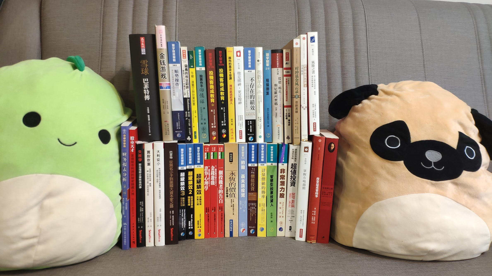

# 書、書、更多書

### 特別推薦

[**不存在的績效**](https://igrape.net/2Tbn7)  
  
****這本書的主題是美國史上最大的金融騙局：馬多夫詐騙案。這個詐騙案的規模有多大呢？接近兩巴菲特！馬多夫在2008年底被逮捕，投資人損失估計高達650億美元，巴菲特當時的身價，依據2009年的富比士排行榜，不過370億美元。

馬多夫身為前NASDAQ主席，全美前幾大的證券經紀商負責人，照理說應該完全不缺錢，為什麼他寧願讓自己最終身敗名裂，也要去經營這個騙局？為什麼只要簡單查個帳就可以揭穿的騙局，最終可以經營20年？為什麼有這麼多豪門巨富，甚至投資銀行，面對理論上不可能存在的績效，仍舊前仆後繼的投入？這本書裡面有太多的問號，作者花了將近十年調查，前後五次向證管會揭發都被打槍，書中詳盡描述了作者艱辛的調查過程，也呼應了英文書名：No One Would Listen。

**當你身邊有什麼投資機會，看起來too good to be true的時候，就把這本書拿起來翻一翻，回憶一下書中關於蒂埃里的故事；當你身邊的朋友家人遇到類似的投資機會，卻不知如何勸告的話，送這本書給他。**  
  
**我很認真的說，不要被騙身家，比什麼投資方法都重要。**

### 價值投資

[**彼得林區 學以致富**](https://adcenter.conn.tw/2bKfc)  
****[**彼得林區 選股戰略**](https://adcenter.conn.tw/2bKfA)  
****[**彼得林區 征服股海**](https://greenmall.info/2bKfV)  
  
****經典不用多介紹，又會投資，講話又超好笑的人不多，彼得林區是其中的佼佼者，一套三本由淺入深，股票六大分類極實用。  
  
[**21世紀價值投資**](https://product.mchannles.com/2ZzG9)  
  
這本書的前半段，主要介紹價值投資者衡量企業的三種主要方式：資產、盈餘、成長，後半段則介紹了8位價值投資人，每個人都有獨特的投資風格。[書摘連結在此](https://stasistw.blogspot.com/2019/10/21.html)。  
  
[**你也可以成為股市天才**](https://www1.gamepark.com.tw/2bKkO)  
  
這本書特別之處在於講述的不是基本投資概念，而是用各種實際案例來說明分拆、合併、重整、套利等，只有少數投資人願意花時間研究的特殊事件，並從中尋找獲利機會。  
  
[**智慧型股票投資人**](https://wonderfulapple.net/2bKmo)  
  
葛拉漢的傳世經典，把股票市場當作投票機與體重機的比喻，至今為人津津樂道，這本書可以協助你建構一套以價值為基礎的投資策略。至於[證券分析](https://www1.gamepark.com.tw/2bKoN)上下集個人覺得偏硬，沒有會計跟投資學基礎大概會覺得是天書，自覺是老手的再考慮挑戰。  
  
[**非常潛力股**](https://idragon.info/2bKpu)  
****[**買股致富**](https://wonderfulapple.net/2bKq7)  
  
兩本都是跟葛拉漢齊名的大師費雪所著，非常潛力股比較有名，書評網路上跟山一樣多，但我個人反倒偏好買股致富。買股致富書中關於法人股與企業併購的觀點，到現在還是頗貼切，我非常喜歡第二章那個描述一家鋼板公司從衰敗中重生，最後成長為法人青睞股的故事。  
  
[**失敗學**](https://www1.oeya.com.tw/2bKqV)  
  
主題非常特別，用大量的實際案例告訴你：企業是怎麼掛掉的。我喜歡作者觀察經營階層的方式，如果身為會跑法說甚至各種公司私訪的研究員，此本必讀。  
  
[**大利從小**](https://buyforfun.biz/2bKrX)  
  
最大的缺點是翻譯我不喜歡，但內容扎實。這本書可能不能讓你成為投資大師，但是卻可以幫你有意識地少犯一些錯，例如規避投資經常遇到的馬後炮跟錨定問題。書名想表達的是，與其漫遊在總體經濟所產生的訊息之海，不如專注在自己熟悉的公司，畢竟分析一家公司跟分析一個經濟體相比，所要面對的變數少上太多了。  
  
[**雷浩斯教你小薪水存好股又賺波段**](https://iorange.biz/2bLGu)  
****[**財報狗教你挖好股穩賺20%**](https://product.mchannles.com/2bLH5)  
  
傳說中的雷霆戰狗系列，台股理論實戰入門最佳選擇，友情推薦。雷浩斯跟財報狗都有其他著作，可以上網搜尋書評，他們的粉絲團也記得加一下。  
  
[**算利教官教你存股利滾利年年領百萬**](https://shoppingfun.co/2bLIK)  
****[**沒有18%我靠股票打造自己的鐵飯碗**](https://www1.gamepark.com.tw/2bLIR)  
  
Smart素人系列書已經多到數不清，這兩本算是我覺得比較有內容的，教官本人對個股的分析相當獨特細緻，也建議去追他的粉絲團。  
  
[**麥克風的股市求生手冊**](https://easymall.co/2bHr_)  
  
****老王賣瓜，自賣自誇。讀完這本電子書覺得有收穫，相挺一下也無妨，但要先聲明內容有不少重複之處。

### 量化價值

[**打敗法人的價值投資法**](https://dreamstore.info/2bKzX)  
****[**WHAT HAS WORKED IN INVESTING**](https://www.tweedy.com/resources/library_docs/papers/WhatHasWorkedFundOct14Web.pdf)  
  
這本書的內容雖然比不上「智慧型股票投資人」專業，卻簡潔扼要的抓住了價值型投資的精髓之處，書中說明要避開具有哪些特質的公司那段，看了令人會心一笑。What has worked in investing則可以當作「打敗法人的價值投資法」的免費英文版，內容集中在文獻回顧，用數據告訴你哪些方法在投資領域有用。  
  
[**超值投資**](https://buyforfun.biz/2QKcy)  
  
除了大量的回測數據外，本書最有趣的地方是詳述了Icahn、Graham、Buffett、Greenblatt等人的投資方式，不時比較這些名家觀點與做法中的異同，如何在量化與質化、煙屁股與優質公司做取捨；面對顢頇的公司經營階層，又如何藉「股東行動主義」來加速釋放公司價值。  
  
[**計量價值的勝率**](https://igrape.net/2bB6x)  
  
跟其他偏內容偏量化的價值投資書籍一樣，這本書提出了相當多的回測數據來說明採取價值投資方法的歷史績效。此外從建立checklist、指標的篩選、投資組合建構、到績效測試都有清楚的描述，若跟我一樣是數據控的話，應該會喜歡這本書。

### 指數投資

[**漫步華爾街**](https://wonderfulapple.net/2bL6u)  
  
以大量的統計數據駁斥許多常見謬誤，也提供了相當實用的投資和資產管理建議。  
  
[**散戶投資正典**](https://idragon.info/2bL77)  
  
****教科書等級的經典，當作「投資百科全書」也無不妨。這本書極力推崇長期投資股票，原因很簡單：債券無法抵抗通貨膨脹，但股票的長期收益會隨通膨上漲；此外書中對近百年來的股市變動、重要的經濟與政治事件，也都有深入的探討。唯有瞭解歷史，才能面對未來。  
  
****[**綠角的基金8堂課**](https://www1.gamepark.com.tw/2bL7D)  
  
****雖然我個人不投資台灣的基金，但我推薦所有會買台灣基金的人去找這本書來看。本書對台灣的基金生態有非常詳盡的描述，對某些歷久不衰的錯誤觀念，例如4433法則，也直接用數據打臉。  
  
****[**指數革命**](https://dreamstore.info/2VlOn)  
  
****這是一本很快可以讀完的小品，作者曾是世界上最大退休基金的顧問，也是主動型基金的操盤手，最終卻提倡指數投資。歷史明確的告訴我們，平庸的表現已經足夠擊敗絕大多數市場的參與者，以及大部分的專業經理人，書中也列舉了10大選擇指數投資的理由。我自認算是附錄中提到的smart beta支持者，但也承認市場效率會持續讓過去有效的方法逐漸失效。

### 專業投機

[**超級績效**](https://pinkrose.info/2bAtz)  
****[**超級績效2**](https://www1.gamepark.com.tw/2bAuI)  
****[**超級績效3**](https://easymall.co/2bAuV)  
  
強推此系列。第一本主要講超級強勢股的特徵，潛在的買進訊號與進場點分析，以及需要定期檢視的各種個股、產業、市場狀態；第二本把策略中的賣出部分做了更詳盡的分析，還有各階段股票的細節判斷、因應策略，最後輔以創造績效跟控制風險的八大重點；第三本則是選出一百多道投資人最常問的問題，從選股、進出場、基本面、技術分析、風險管理、心理建設，幾乎都是實際交易時會遇到的。  
  
[**專業投機原理I**](https://ibanana.biz/2bLEL)  
****[**專業投機原理II**](https://shopsquare.co/2bLEM)  
****  
建議所有有志投機的人都要看，從經濟分析，統計技術，到心理與交易哲學都有詳盡的介紹，內容重複率稍高，可以只買一。  
  
[**投資最重要的事**](https://buyforfun.biz/2bLES)  
****[**掌握市場週期**](https://pinkrose.info/2SobG)  
  
Howard Marks BJ4. 我比較喜歡投資最重要的事。  
  
[**史瓦格期貨技術分析上**](https://igamepark.biz/2bLEY)  
****[**史瓦格期貨技術分析下** ](https://pinkrose.info/2bLEa)  
  
開頭漫步派和技術派的爭論值得一看，書中詳盡的解釋了各種型態、指標所代表的意義，與良好系統的設計方法與評估，做做後面的自我練習，相信會對所謂的技術分析有些新的體會。  
  
[**交易．創造自己的聖盃**](https://pinkrose.info/2bNV2)  
  
如果不清楚自己要如何建構交易系統的，這本是最好的指南之一。該書內容主要分成三大部份：心理自我探索、建構交易系統、關鍵操作技巧。多數人在交易時只著重後兩者，但最後毀滅自己的往往是前者。本書試圖教讀者找到真正的「聖杯」：根據自己的個性、資金規模、風險承受度等，來建立專屬自己的交易原則。結論中提到交易紀律的要點都是關鍵，我只提其中兩點：認知自己必須承擔所有責任、分析自己的缺點並修正。  
  
[**趨勢交易正典：成為多空百萬贏家**](https://igrape.net/2bLEg)  
  
本書主要分為四部分，第一部分是介紹順勢投資法與著名的順勢操作者，第二部分介紹順勢投資史上的重大事件，第三部分討論人類行為與決策制訂，第四部分則是交易系統與賽局。順勢操作說穿了就是停損、讓獲利奔馳、大賺小賠，這幾個字說來簡單，要實踐可就難了，讀完這本書可以幫你先做好對應的心理建設。  
  
[**順勢操作：多元化管理的期貨交易策略**](https://easyfun.biz/2bLEj)  
  
這本書的前三分之一告訴你怎麼利用各種商品：利率、外匯、農業、非農業、股票來建構真正「全球化」的順勢投資組合；後三分之二則是描述這套策略在近20幾年的交易行為與績效波動，重點是不是單純描述結果，而是逐年逐月告訴你組合裡哪些商品表現好，哪些商品又讓你遭受打擊，讀完就好像看了別人實際經營幾十年的商品基金一樣，非常獨特的一本書。

### 傳記箴言

[**雪球**](https://igamepark.biz/2bLFa)  
****[**巴菲特：從無名小子到美國大資本家之路**](https://idragon.info/2bLF_)  
  
前者偏巴菲特個人傳記，後者比較像投資傳記。我個人喜歡後者的敘事方式，可以清楚了解到巴菲特投資經歷中，遇到各種重大事件時的應對，缺點是只記錄到1990年代，看不到近年的故事；前者對巴菲特的描述更加貼近，就像在他身旁生活一般。  
  
[**窮查理的普通常識**](https://ibestfun.net/2bLHw)  
  
巴菲特夥伴孟格的經典之作。初看似乎跟投資關聯不大，但書中滿溢的人生智慧值得一讀再讀，標準隨著人生經歷增加，每次重讀都會有新體會的好書。  
  
[**華爾街刺蝟投資客**](https://www1.oeya.com.tw/2bLGC)  
****[**華爾街刺蝟投資客之投資啟示錄**](https://pinkrose.info/2bLGG)  
****[**對沖基金風雲錄3 王者私語**](https://joymall.co/2bLGK)  
****  
Barton Biggs是我最愛的投資作家之一，華爾街教父級人物，也是個成功的避險基金經理人。當初讀第一本驚艷到特別上Amazon從美國郵寄了原文版來收藏，台灣到目前還沒出第三本，只有簡中版。「[財富、戰爭與智慧：二戰啟示錄](https://greenmall.info/2bLHb)」雖然內容跟股市相關性較低，但我也很愛。  
  
****[**一個投機者的告白**](https://easymall.co/2bLHe)  
****[**一個投機者的告白之金錢遊戲**](https://greenmall.info/2bLHi)  
****[**一個投機者的告白之證券心理學**](https://joymall.co/2bLHk)  
  
科斯托蘭尼的投機經典三部曲。  
  
[**金融怪傑\(上\)**](https://www1.oeya.com.tw/2bLIh)  
****[**金融怪傑\(下\)**](https://whitehippo.net/2bLIp)  
  
最簡單的成功方法就是模仿成功者的心態與思維，類似的系列還很多，像是新金融怪傑、新世紀金融怪傑等，請自行上網搜尋。  
  
[**股票作手回憶錄**](https://easyfun.biz/2bLIf)  
  
Livermore的巨作，自傳中充滿了投機的經驗與智慧。老火雞的故事必讀，身為半個趨勢操作者，我自己沒事就會重看那段。  
  
[**金錢遊戲**](https://ibanana.biz/2bLI-)  
  
****Adam Smith寫的股市浮生錄，書中一開始就點出了，這是場關於金錢的遊戲，但博弈的目的卻不在金錢，而是遊戲的過程本身。誰制定了遊戲的規則？誰是遊戲的玩家？誰是遊戲裡的犧牲者？這本書用詼諧的筆法揭示了市場的種種黑暗面。  
  
****[**他是賭神，更是股神**](https://igrape.net/2bLJ3)

### 延伸閱讀

[**隨機騙局：潛藏在生活與市場中的機率陷阱**](https://product.mchannles.com/2bLJR)  
  
作者是因金融海嘯暴紅的塔雷伯，這本書一度絕版好幾年，前陣子才重出新版，他後來的著作都偏硬，這本相對平易近人的多，讀完此書可以了解在現實生活中，有許多隨機的現象，會以非隨機的面貌出現，也一再愚弄了大眾。  
  
[**風險之書**](https://ibestfun.net/2bLJk)  
  
英文書名我覺得非常有氣勢，翻成風險之書雖然切合內容，但少了點韻味。風險史其實就是賭博史，好聽一點可以說是機率史。這本書沿著歷史長河來介紹風險這個概念的發展，如何用各種數學方式來評估未知。題外話，中文版一版「與天為敵」1998年出版，二版「馴服風險」2006年出版，最新版今年出，大家這兩年要認真開始考慮賣股票了。  
  
[**股價、棉花與尼羅河密碼**](https://buyforfun.biz/2bLJq)  
  
****蠻有趣的科普書籍，但老實說不好懂。作者認為用碎型能夠解釋更多市場行為，因為市場風險並非屬於常態分布，而是長尾分布；市場的本質不穩定，蝴蝶效應俯拾即是；股價的走勢是隨機，但又有微弱的相依性，而非完全隨機。企圖要用數學說明市場，就是這麼饒口而複雜的一件事。書裡面的一些碎形圖很美。  
  
[**操盤快思X投資慢想：當查理．蒙格遇見達爾文**](https://dreamstore.info/2bOx1)\*\*\*\*

要對市場有更深層的理解，就不能永遠死守在經濟財金這塊領域**，**而該更廣泛的去了解各學門的基本知識，窮查理的通俗版。  
  
****還有一些我很喜歡但絕版的書，在舊書攤看到可考慮，例如：

**投機客養成教育上  
投機客養成教育下**  
  
這兩本和專業投機原理同是經典之作，雖然原作在亞洲金融風暴時crash了，但不減此書的可讀性，而且在市場待得越久，讀起來越有味道。熱愛拜神者請看第三章，喜歡從眾者則該看看第九章。  
  
**穩操勝算**  
  
純線仙派和搞不清楚自己為何是超級反指標的人，都應該去找這本書來看。[當年的書摘](https://www.ptt.cc/bbs/Trading/M.1104990082.A.629.html)。  
  
**一個計量金融大師在華爾街**  
  
研究物理時，你是在與上帝交手；而在財務學領域，你是與上帝的創造物交手，有在交易衍生性商品的都可以去看，多少可以了解自己是怎麼被玩的。

