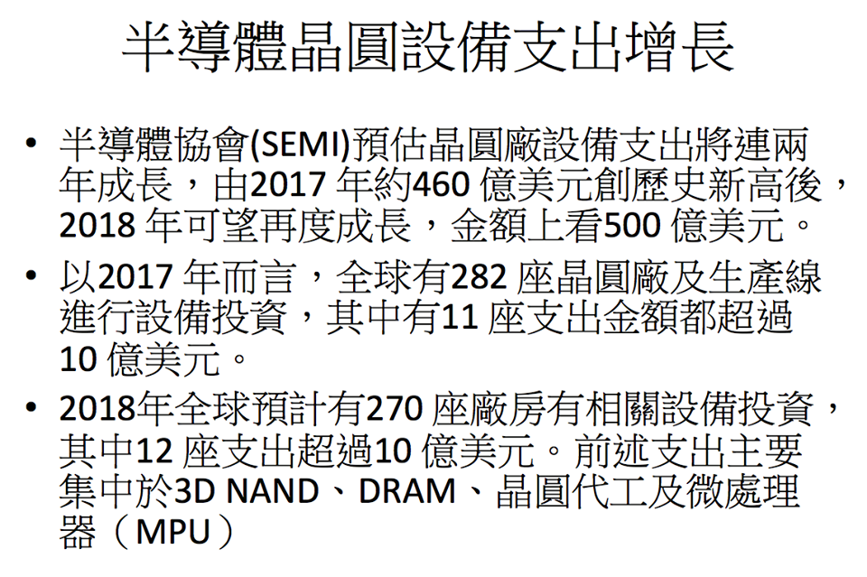
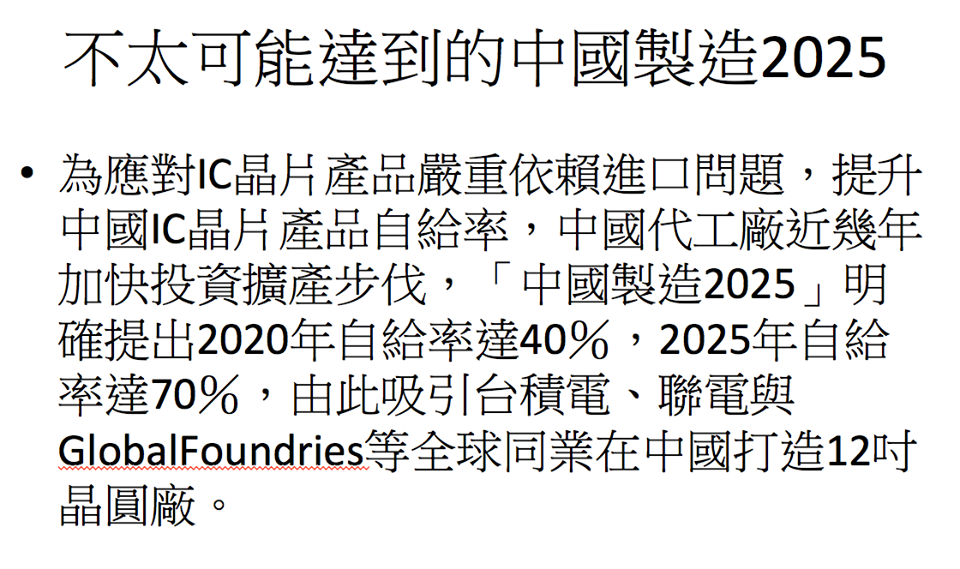
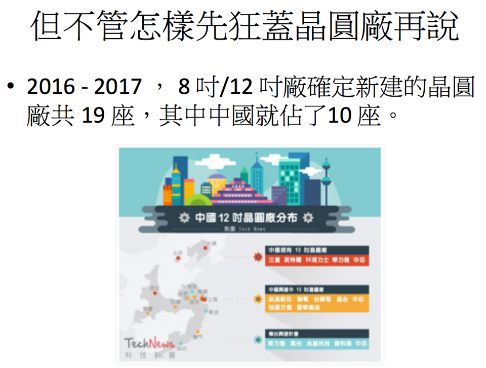
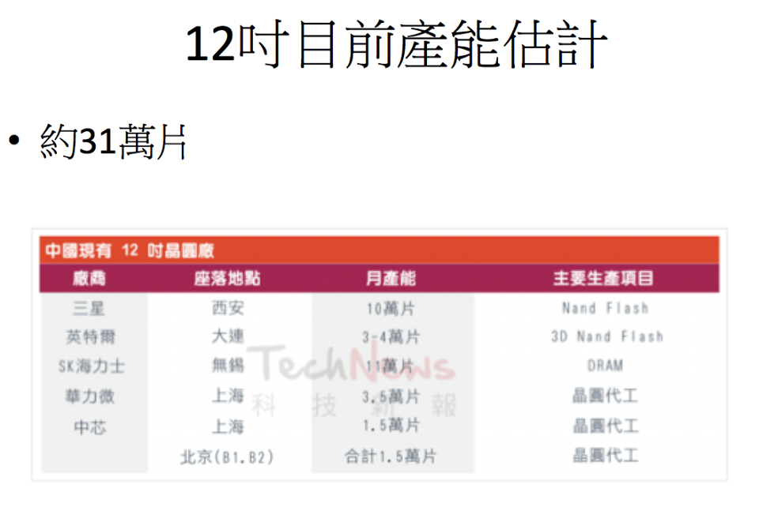
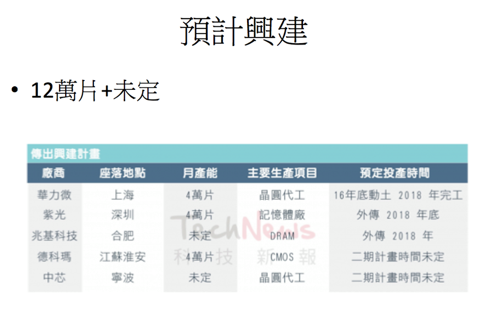
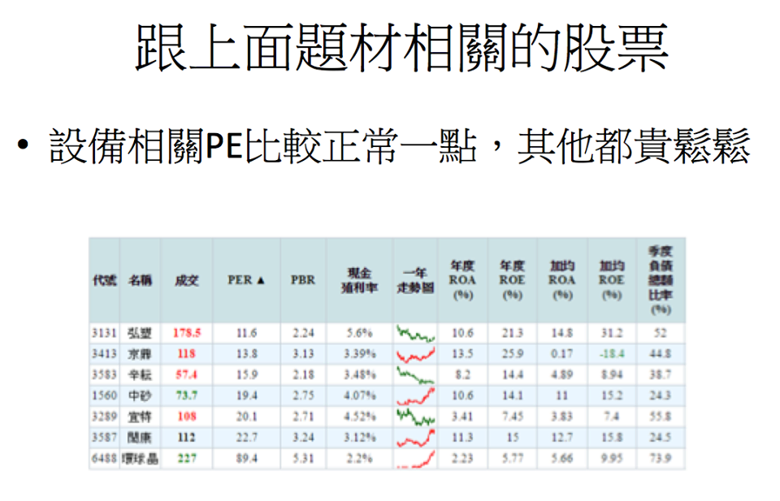
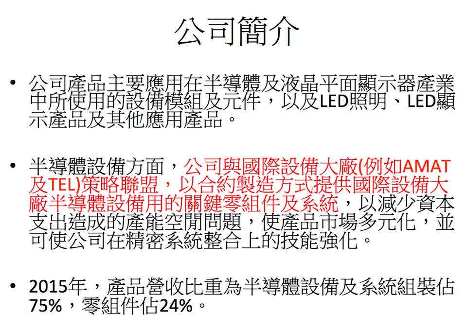
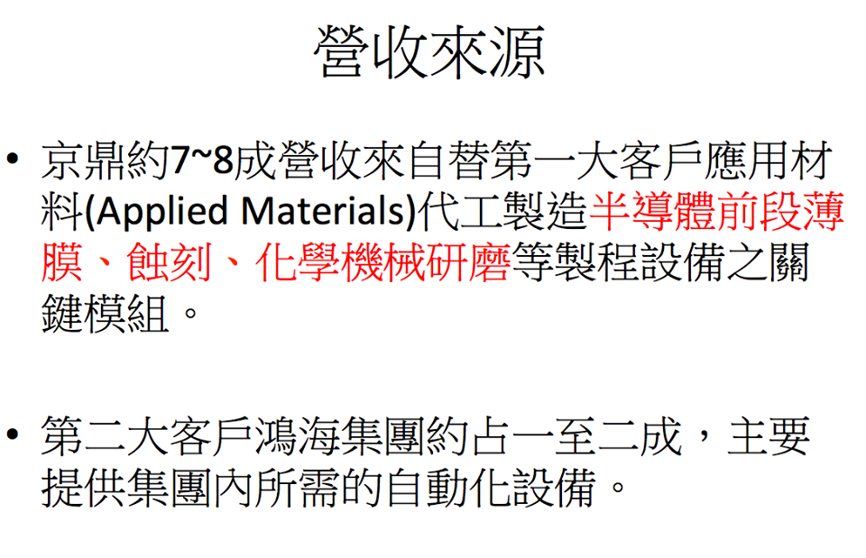
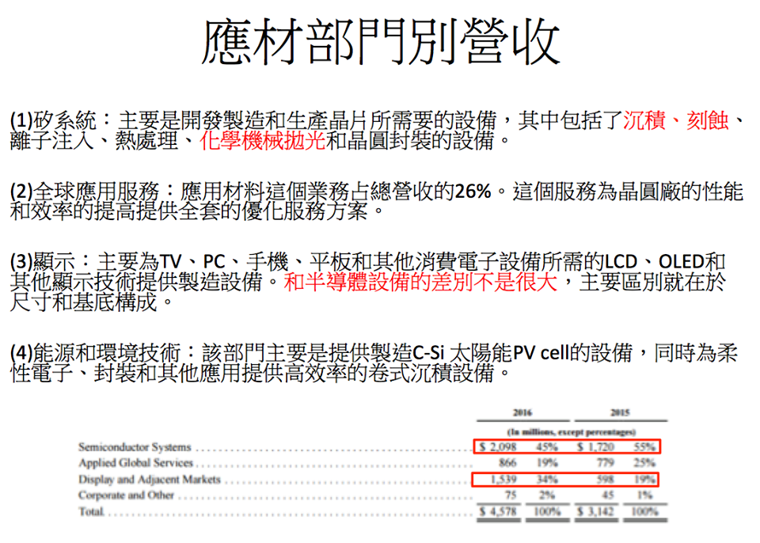
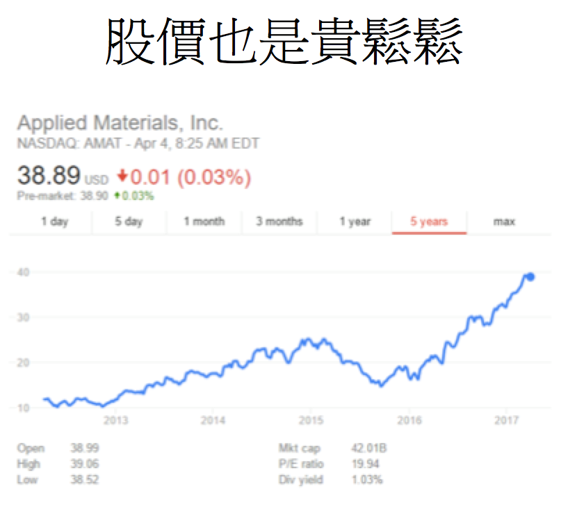

# 做功課的方法

除了用量化方式進行篩選外，若有心要學習質化分析，也可以試著強迫自己固定花點時間去做研究，像在各種股市討論區貼認真的分析文也是一種方式。下面試以一篇自己做的分析投影片作為例子，說明產業個股研究可以如何著手：

\*這是2017做的研究，內容已經不適用於貿易戰興起的現在  
  
以下說明研究的思路，以及如何使用關鍵字蒐集資訊。當初會注意到是因為其中一個投資群組聊到宜特跟閎康，用「股票名稱」「研究報告」兩個關鍵字，就可以找到幾篇長篇分析文：

雖然覺得這兩檔本益比都過高，但背後半導體擴廠的題材激起了我的興趣，還是一樣用google搜尋「半導體」「擴廠」，就可以找到[這篇新聞](http://www.appledaily.com.tw/realtimenews/article/new/20170308/1071757/)。該篇新聞提到報告名稱World Fab Forecast，再用該關鍵字去搜尋可以找到[這篇報告](https://www.semi.org/en/news-resources/market-data/world-fab-forecast)。

用「中國」「晶圓廠」「產能」當關鍵字則可以找到[這篇分析](http://technews.tw/2016/10/17/china-300mm-fab/)，只要簡單的計算就可以知道這幾年會有大量產能開出，照理說建廠時設備廠會先受益，產能開出後矽晶圓和檢測廠才會反應，但當時的相關類股的股價，卻是晶圓跟檢測提早反應，所以我就開始研究設備廠。

說到半導體設備廠，直覺會想到AMAT跟ASML這兩家，前者是全球最大，後者是擁有最先進製程EUV，還讓intel三星GG共同投資加速製程開發。google你會找到[這篇](https://zhuanlan.zhihu.com/p/21632080)還有[這篇](https://www.zhihu.com/question/42963443)，讀完可以對產業多些基礎認知，也會知道EUV中國目前還沒法進口，所以上面的中國2025題材，ASML恐怕受惠的程度較小。那就來看看AMAT吧，AMAT是美國上市公司，直接從官網就可以[下載財報](http://www.appliedmaterials.com/company/investor-relations/financials)：

從財報就可以找到營收最大成長區域\(中國\)跟最大客戶\(GG\)，再看一下在手訂單量，就可以知道上面講的題材不是唬爛的，而且AMAT的股價也持續在創新高。接下來就是找AMAT的供應鏈，搜尋「應用材料」「供應商」就可以找到好幾檔標的。其中我最有興趣的是3413 \(ROE最高 近年獲利持續成長\)，搜尋「moneydj」「京鼎」，就可以找到人家[整理好的簡介](https://www.moneydj.com/KMDJ/Wiki/wikiViewer.aspx?keyid=141d7096-8bb6-42c3-a23e-649c0eb7449a)：  
  
「公司主要業務是製造半導體相關設備為主，應用於半導體設備及LCD設備產業的領域，包括**薄膜沉積設備、蝕刻設備、檢測設備、雷射應用設備及自動化傳輸設備**為主。」  
  
再對照一下[應材的主要營業部門Silicon systems](https://read01.com/kPnaJ5.html)：  
  
「這是應用材料營收占比最大的部門，2015的營收占總營收的64%。主要是開發，製造和生產晶片所需要的廣泛設備，其中包括了**沉積、刻蝕、離子注入、熱處理、化學機械拋光和晶圓封裝**等晶片製造必不可少的設備。」  
  
看起來重疊度還蠻高的，簡單推測應材吃飽飽，京鼎應該也可以分到不少肉，在當時那篇分析的結論是：

1. 市場對晶圓廠設備支出擴張還沒有充分反映 \(在炒檢測跟矽晶圓\) 
2. 獲利連三年成長，符合市場對成長股的定義，且2017-2018應該能維持獲利成長
3. 長期最大的風險就是營收過於單一，應材轉單就完蛋。

為什麼花時間研究之外，還要特地做個powerpoint呢？因為我有參加幾個每月舉行的投資研討會，流程大致上就是參加者輪流報告，主要是個股或產業分析，像是前陣子就有國內鋼鐵業龍頭的從業人員，教大家怎麼去判斷鋼鐵業景氣，例如去從源頭追鐵礦砂指數、港口庫存量、鋼廠盤價等等。

甚至有一個讀書會都在討論美股，我自己在美股投的錢不到總資金5%，花時間研究這些看起來完全是浪費時間，但是換到的是眼界的增長。美股太多在台灣不太容易想像的公司，像是我去年研究的一家公司，代號CALM，本業是「賣雞蛋」，而且就只有賣雞蛋。理論上蛋業幾乎是完全競爭市場，但這家公司在沒有舉債的狀況下，靠併購近10年毛利成長5倍，漲了差不多10倍，藉著研究去了解其背後的商業模式，才是真正有趣的地方。  
  
俗話說：有施才有得，我分享自己靠google就可以做的分析，可以換到數倍甚至十數倍其他人的研究，其中不乏各產業業內的深入分析，這是我早期純粹自己研究永遠得不到的知識。個人是覺得收穫超多超划算，有心人也可以試著自己組織看看。

最後給大家一個表，同樣是散戶，你希望當輸家，還是贏家？

| 輸家散戶 | 贏家散戶 |
| :--- | :--- |
| 別人賺錢都攏系Lucky | 從別人賺錢的經驗中有什麼可學 |
| 我散戶，蝦米攏某 | 雖然我散戶，但我能做什麼 |
| 只想知道暴賺秘笈，其他沒興趣 | 廣泛學習除了賺錢，也是種樂趣 |
| 短期致富，幻想式的報酬率 | 合理且有機會達成的報酬率 |
| 先買進/交往再說，股票/女友慢慢認識 | 先深入研究，再找合理價位買進股票 |
| 股市是賭場，行運一條龍 | 股市是戰場，多算勝，少算不勝 |
| 期待 | 等待 |

